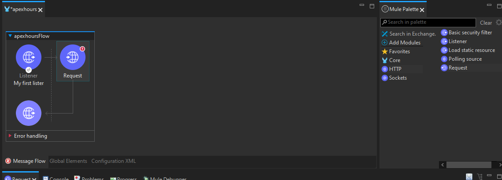
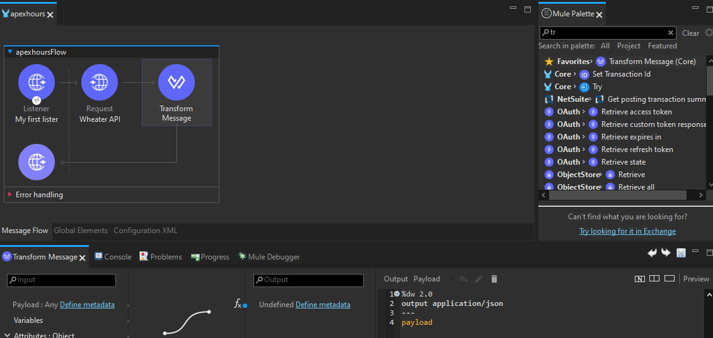
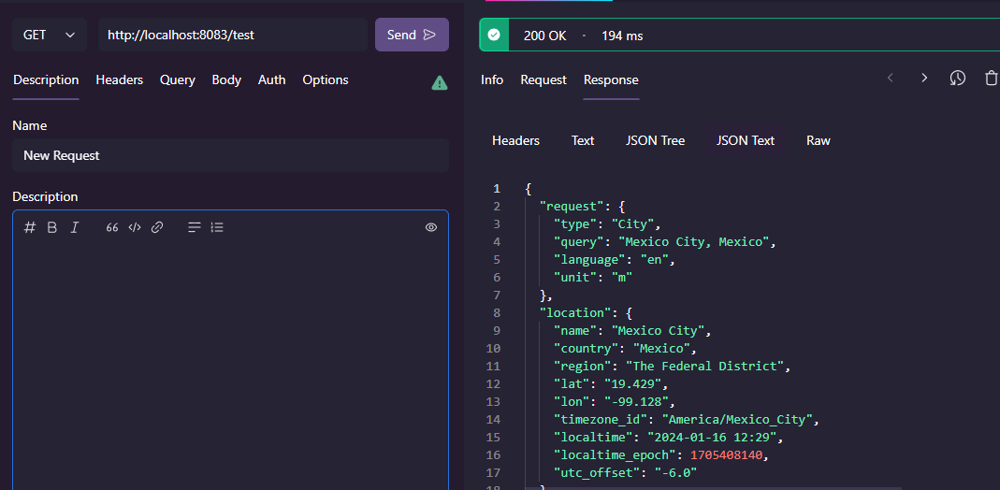
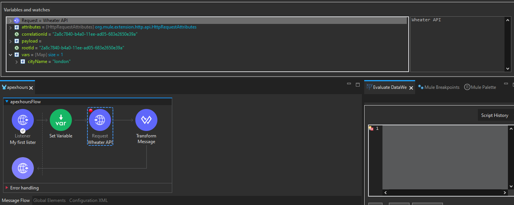
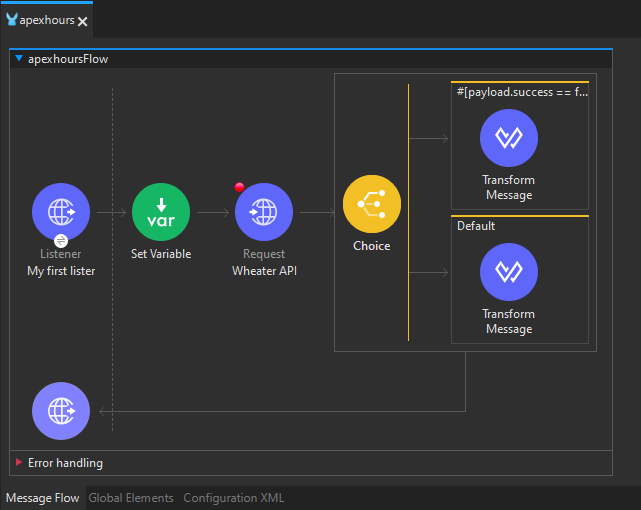
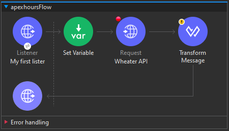
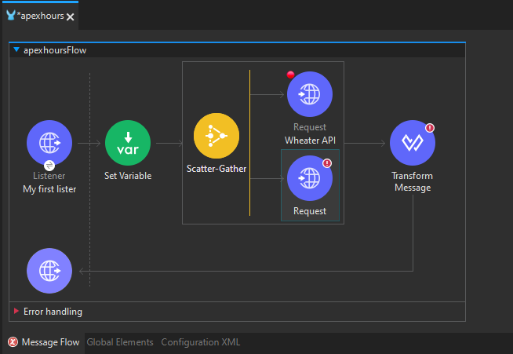
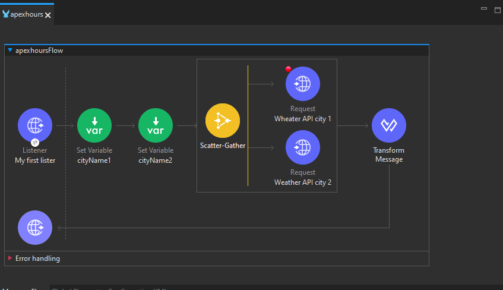
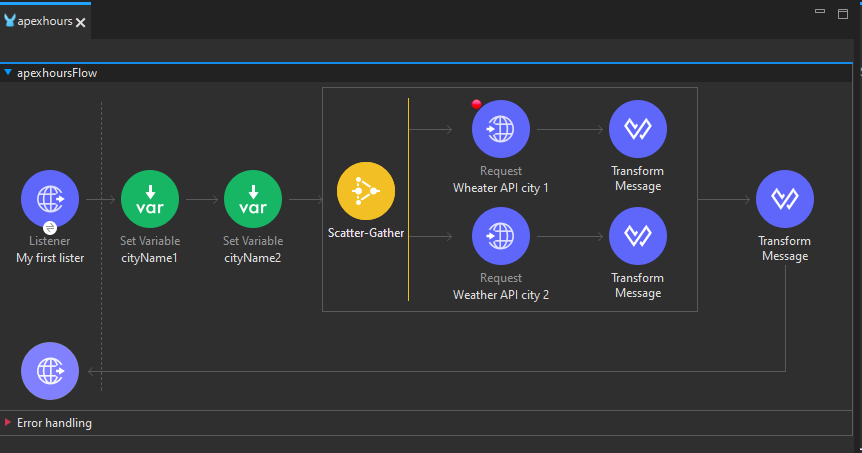
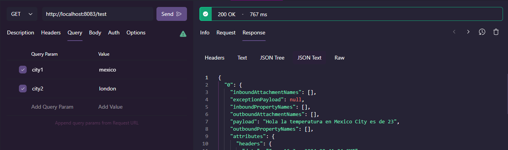

# Consideraciones Importantes al Conectar con Sistemas Externos

Conectar con sistemas externos, ya sean bases de datos, Salesforce, SFTP o cualquier servicio web externo, requiere una atención cuidadosa y una comprensión detallada. Aquí hay aspectos clave a tener en cuenta:

**Detalles de Configuración:**
Antes de establecer la conexión, recopile los detalles de configuración esenciales necesarios para conectarse con el sistema externo. Esto puede incluir información como URL, credenciales, claves de API y otros parámetros relevantes.

**Requisitos de la Petición:**
Comprenda la estructura y los requisitos de la petición que el sistema externo espera. Esto implica conocer los parámetros necesarios, el formato de la solicitud y cualquier consideración específica de la API.

**Seguridad:**
Evalúe los aspectos de seguridad asociados con la conexión al sistema externo. Determine si se requieren tokens de autenticación, certificados SSL u otras medidas de seguridad para establecer una comunicación segura.

**Tipo de Respuesta:**
Explore el tipo de respuesta que el sistema externo devuelve. Comprender la estructura y el formato de la respuesta es fundamental para procesar y utilizar eficazmente los datos recuperados.

**Tiempo de Respuesta:**
Es beneficioso conocer el tiempo que el sistema externo tarda en responder. Esto permite configurar adecuadamente los tiempos de espera para gestionar situaciones en las que la respuesta puede demorarse.

Estas consideraciones garantizan una integración exitosa y eficiente con sistemas externos, asegurando que la comunicación sea fluida, segura y alineada con los requisitos específicos de cada sistema.

# HTTP Request

El componente HTTP Request se utiliza para realizar llamadas a otros servicios web, lo que es esencial en la integración de sistemas. Algunos puntos clave sobre su uso y configuración son los siguientes:

**Ubicación en el Flujo:**
El componente HTTP Request debe colocarse únicamente en el área "Process" de un flujo, private-flow o sub-flow.

**Configuración Necesaria:**
Asegúrese de proporcionar todos los datos necesarios para el componente HTTP Request, como la URL del servicio, el método HTTP a utilizar, y la carga útil esperada por el servicio externo. Además, considere los atributos esenciales como queryParams y headers.

**Detalles de Configuración Obligatorios:**
- **Protocolo:** Especifica el protocolo a utilizar (HTTP o HTTPS).
- **Método:** Indica el método HTTP que se utilizará para la solicitud (GET, POST, PUT, DELETE, etc.).
- **URL o Ruta:** Si proporciona la URL completa, no son necesarios detalles como host y puerto. Sin embargo, si proporciona solo la ruta, es necesario especificar host, puerto y ruta.
  
**Configuración Adicional:**
Puede pasar información adicional en las pestañas correspondientes del componente:
- **Cuerpo (Body):** Contiene la carga útil de la solicitud.
- **Encabezados (Headers):** Permite especificar encabezados HTTP adicionales.
- **Atributos (Attributes):** Proporciona detalles adicionales sobre la solicitud.
- **Parámetros de Consulta (QueryParams):** Permite incluir parámetros de consulta en la solicitud.

La configuración precisa de estos detalles garantiza una comunicación efectiva con el servicio externo, evitando errores y asegurando que la solicitud cumpla con los requisitos del servicio. La ubicación adecuada y la atención a los detalles son fundamentales para el correcto funcionamiento del componente HTTP Request en un flujo de integración.

# Actividad, Parte 1

1. Para la realización de las siguientes actividades será necesario hacer uso de alguna API externa, en este caso sera la de [Weatherstack](https://weatherstack.com/), crea una cuenta gratis para poder hacer uso de su `api key`

2. Una vez tengamos nuestro dashboad a la vista iremos a la [documentación](https://weatherstack.com/documentation) de dicha API

> [!IMPORTANT]
> Al ser una cuenta de uso gratuito hay que usar `http` en lugar de `https` en la URL, ya que de no ser asi nos dara un mensaje de que debemos actualizar nuestro plan de pago

3. Hacemos una pequeña prueba de que todo este en orden ya sea en nuestro navegador o en nuestro tester de APIs, como en este caso que usare RapidAPI dondé colocaremos la siguiente URL
    ```url
    http://api.weatherstack.com/current?access_key={API_KEY}&query=New%20York
    ```

    si todo sale bien, nos dara una respuesta como esta:
    ```json
    {
        "request": {
            "type": "City",
            "query": "New York, United States of America",
            "language": "en",
            "unit": "m"
        },
        "location": {
            "name": "New York",
            "country": "United States of America",
            "region": "New York",
            "lat": "40.714",
            "lon": "-74.006",
            "timezone_id": "America/New_York",
            "localtime": "2024-01-16 12:22",
            "localtime_epoch": 1705407720,
            "utc_offset": "-5.0"
        },
        "current": {
            "observation_time": "05:22 PM",
            "temperature": -1,
            "weather_code": 311,
            "weather_icons": [
            "https://cdn.worldweatheronline.com/images/wsymbols01_png_64/wsymbol_0021_cloudy_with_sleet.png"
            ],
            "weather_descriptions": [
            "Light Freezing Rain, Mist"
            ],
            "wind_speed": 17,
            "wind_degree": 60,
            "wind_dir": "ENE",
            "pressure": 1008,
            "precip": 0.9,
            "humidity": 89,
            "cloudcover": 100,
            "feelslike": -5,
            "uv_index": 1,
            "visibility": 5,
            "is_day": "yes"
        }
    }
    ```

4. Abrimos nuestro `Anypoint Studio` en nuestro proyecto que llevamos trabajando desde los capitulos anteriores

5. Vamos a eliminar nuetros 2 `Logger` y nuestro `Transform Message`

6. Arrastramos el conector `HTTP Request` y lo colocamos a lado de nuestro `Listener`

<div align="center">
    
</div>

7. Ahora en su configuración vamos a hacer lo siguiente, su `Display Name` colocaremos `Weater API`

8. Ahora en `Configuration` simplemente daremos click en el `+` dejaremos todo por default y simplemente damos `ok`

9. En `URL` colocaremos la url base que en este caso sería `http://api.weatherstack.com/current`, lo pondremos tal cual, sin dar click en _`Fx`_ o encerrarlo entre `""`

10. Más abajo veremos una serie de pestañas entre las que se encuentra `Query Parameters`, daremos click ahí y seguido de eso en el simbolo de `+`, debera aparecer un primer renglón en la tabla con datos por default, podremos modificarlos directamente o dar click en _`Fx`_, deberemos agregar el `query parameter` de nuestro `API_KEY` de la siguiente manera:
    ```json
    output application/java
    ---
    {
        "access_key" : "6640303e2b004bdd1409b2aaaf3ecbcc",
        "query" : "Mexico"
    }
    ```

    volvemos a dar click en _`Fx`_ y veremos que los datos del primer renglón y segundo renglón de la tabla ya coinciden con lo que colocamos en código

> [!NOTE]
> Recordemos que acces_key y query vienen de la URL que nos da la documentación de Weatherstack y que probamos previamente en el paso 3

11. Agregamos un `Tranform Message` a lado de nuestro `Request` y simplemente en el código agregamos lo siguiente:
    ```properties
    %dw 2.0
    output application/json
    ---
    payload
    ```

12. Guardamos todo, compilamos y si recordamos la URL para probar nuestra aplicación es en el puerto `8083`, osease: `http://localhost:8083/test`, probamos dicha URL con Postman o RapidAPI y debería retornarnos la respuesta de la API de `Weatherstack`

<div align="center">
    
    
</div>

13. En el paso `10` dejamos hardcodeado el valor de la `query`, pero eso nos limita, deberíamos poder hacer que eso funcione de manera dinamica por medio de `Query params` pero en nuestra URL de `http://localhost:8083/test`, para ello vamos a hacer uso de las `variables`

14. Arrastra el conector `Set Variable` entre el `Listener` y `Request`

15. Llenamos los parametros de la siguiente forma:
    - `Name`: **cityName**
    - _`Fx`_: **#[attributes.queryParams.name]**

16. En nuestro `Request` en el código de los `Query Parameters` modificamos para hacer uso de nuestra variable:
    ```json
    output application/java
    ---
    {
        "access_key" : "6640303e2b004bdd1409b2aaaf3ecbcc",
        "query" : vars.cityName
    }
    ```

17. Agregamos un `Breakpoint` en nuestro `Request` y podemos hacer debug para ver que sucede con más exactitud con nuetro programa

18. Probamos la API con una URL como esta: `http://localhost:8083/test?city=london`

<div align="center">
    
</div>

19. Ahora pongamos en practica lo que hemos realizado en los capitulos de DataWeave, vamos apersonalizar un poco la salida de manera que no sea todo el JSON que nos da `Weatherstack`, para ello vamos al código de `Transform Message` y agregamos algo como esto:
    ```properties
    %dw 2.0
    output application/json
    ---
    "Hola la temperatura en " ++ payload.location.name ++ " es de " ++ payload.current.temperature
    ```

> [!NOTE]
> También en vez de usar `payload.location.name` podemos aprovechar que ya tenemos ese valor en nuestra variable y podems colocar `vars.cityName` en su lugar

20. Guardamos y probamos nuestra aplicación

> [!IMPORTANT]
> En este punto surge una cuestión importante, si probamos con una ciudad que la API del clima no maneja nos dara un error pero nuestra aplicación no esta preparada mara manejar ese tipo de errores, por lo que de eso ira el tema que veremos a continuación

# Router de Decisión (Choice)

El router de decisión, conocido como Choice en Mule 4, juega un papel crucial al dirigir mensajes a través de un flujo basándose en la evaluación de una expresión. Aquí hay algunos aspectos clave sobre el uso del router Choice:

**Funcionamiento Básico:**
El router Choice toma decisiones en función de la evaluación de expresiones. Cada ruta en el Choice representa una opción y se ejecutará si la expresión asociada a esa ruta se evalúa como verdadera.

**Ejecución Única:**
Solo una de las rutas en el Choice se ejecuta. Esto significa que una vez que una expresión se evalúa como verdadera y su ruta se activa, las demás rutas se omiten. Este comportamiento garantiza que solo se siga una ruta en función de la primera expresión verdadera encontrada.

**Ruta por Defecto:**
Si ninguna de las expresiones es verdadera, el flujo se dirige a la ruta predeterminada, también conocida como la ruta por defecto. Es esencial tener una ruta por defecto para manejar casos en los que ninguna de las condiciones especificadas es verdadera.

**Ejemplo Práctico:**
Supongamos que se está construyendo un flujo para procesar pedidos en un sistema de comercio electrónico. Se podría utilizar un Choice router para dirigir los pedidos en función de su estado. Por ejemplo:
```xml
<choice>
    <when expression="#[payload.status == 'Pending']">
        <!-- Ruta para pedidos pendientes -->
    </when>
    <when expression="#[payload.status == 'Processing']">
        <!-- Ruta para pedidos en proceso -->
    </when>
    <otherwise>
        <!-- Ruta por defecto para otros estados -->
    </otherwise>
</choice>
```

En este ejemplo, el Choice router evaluará el estado de cada pedido y dirigirá el flujo según el estado encontrado.

El router Choice proporciona una estructura lógica y flexible para manejar múltiples escenarios en un flujo de integración, permitiendo tomar decisiones dinámicas en función de las condiciones del mensaje.

# Actividad, Parte 2

1. De nuestro `Mule Palette` arrastramos el componente `Choice` y lo colocamos entre nuestro `Request` y nuestro `Transform Message`

2. Arrastra nuestro `Transform Message` dentro del cuado de `Choice` que tiene el nombre de `Default`

3. Agrega un nuevo `Transform Message` dentro del otro cuadro de `Choice`

4. En el nuevo `Transform Message` agregaremos el siguiente código/mensaje:
    ```dw
    %dw 2.0
    output application/json
    ---
    "Hey, has colocado un nombre erroneo: " ++ vars.cityName ++ " agrega un nombre valido"
    ```

    recuerda, nos idica error por que aún no sabe cuál es el valor de `cityName`

5. Ahora da click en el nombre del cuado que contiene el nuevo `Transform Message`, eso nos permitira modificar su `Expression`

6. Da click en el _`Fx`_ del `Expression` y agrega lo siguiente: `#[payload.success == false]`, con eso le estamos indicando de que en caso de que falle nuestro programa por que se busco una ciudad que no existe dentro de la API del clima nos de el mensaje que colocamos en el nuevo `Transform Message`

<div align="center">
    
</div>

7. Guarda y prueba el programa colocando a proposito un nombre de ciudad erronéo

# Scatter-Gather

El componente Scatter-Gather en Mule 4 es una herramienta poderosa que envía el mensaje de solicitud a múltiples destinos de manera concurrente, recopila las respuestas y las agrupa en un único mensaje. Aquí se detallan aspectos importantes de su funcionamiento:

**Ejecución Concurrente:**
Scatter-Gather ejecuta las rutas concurrentemente, lo que significa que envía la solicitud a varios destinos al mismo tiempo. Sin embargo, espera hasta que todos los destinos hayan completado su ejecución antes de continuar con el flujo.

**Resultado Agregado:**
El resultado del Scatter-Gather es una combinación de todas las respuestas de los diferentes destinos. Cada respuesta incluye tanto la carga útil como los atributos correspondientes.

**Manejo de Errores:**
Es una buena práctica encapsular cada destino dentro de un bloque Try-Block con On-Error-Continue. Esto permite manejar cualquier error que pueda ocurrir en uno de los destinos y garantiza que el proceso se complete exitosamente, incluso si algunos destinos fallan.

**Manejo de Fallos:**
Es crucial recordar que si alguno de los destinos falla dentro del Scatter-Gather, el proceso completo se considera fallido. La robustez en el manejo de errores es esencial para garantizar la integridad del proceso.

**Tiempo Total de Procesamiento:**
El tiempo total tomado para procesar todos los destinos es el máximo tiempo tomado por uno de los destinos. Esto significa que el rendimiento general puede estar limitado por el destino que tarda más en responder.

**Ejemplo de Uso:**
En un escenario de integración, el Scatter-Gather podría utilizarse para enviar solicitudes a diferentes servicios web y combinar las respuestas para proporcionar una vista consolidada de la información.

```xml
<scatter-gather>
  <route>
    <!-- Configuración del primer destino -->
  </route>
  <route>
    <!-- Configuración del segundo destino -->
  </route>
  <!-- ... Configuración de otros destinos ... -->
</scatter-gather>
```

El Scatter-Gather es una herramienta valiosa para realizar operaciones concurrentes y consolidar resultados, mejorando la eficiencia y el rendimiento en escenarios donde se requiere procesar múltiples destinos simultáneamente.

# Actividad, Parte 3

1. Vamos a eliminar el `Choice` por lo que antes de eso, saca el `Transform Message` que tenemos en `Default` y colocalo a un lado para que volvamos a como teniamos antes nuestro programa

<div align="center">
    
</div>

2. Vamos a intentar que nos devuelva el `payload` la información de 2 ciudades distintas, haciendo que la URL reciba 2 _query params_ como por ejemplo: `http://localhost:8083/test?city1=mexico&city2=london`

3. Primero arrastramos el componente `Scatter-Gather` y lo colocamos entre `Set Variable` y `Request`

4. Colocamos nuestro `Request` dentro del `Scatter-Gather` y agregamos uno nuevo de igual forma dentro del `Scatter`

<div align="center">
    
</div>

5. Vamos a cambiar algunos nombres, empezando por `Set Variable` la cual cambiaremos lo siguiente:
    - `Display Name`: **cityName1**
    - `Name`: **cityName1**
    - `Value`: **[#attributes.queryParams.city1]**

6. En cuanto a nuestro `Weather API`:
    - `Display Name`: **Weather API city 1**
    - En los `Query parameters` modificar el código para que use el nuevo nombre de la variable: `vars.cityName1`

7. Agregamos una nueva variable justo despues de la que ya tenemos y esta sera nuestra `cityName2`:
    - `Display Name`: **cityName2**
    - `Name`: **cityName2**
    - `Value`: **[#attributes.queryParams.city2]**

8. El nuevo `Request` configuralo como lo hicimos con el que ya teniamos pero tomando en cuenta que este trabajara con `cityName2`

<div align="center">
    
</div>

9. Ahora nuestro `Transform Message` lo colocaremos dentro del `Scatter` y delante de nuestro `Request city 1`

10. Agregamos un nuevo `Transform Message` de igual forma pero esta vez delante de nuestro `Request city 2`, copia y pega para que el codigo sea el mismo y no tengamos que hace nada más

11. Colocamos un tercer `Transform Message` pero este fuera del `Scatter` como teniamos nuestro primer `Transform Message` y en su código colocaremos algo como:
    ```properties
    %dw 2.0
    output application/json
    ---
    payload
    ```

<div align="center">
    
</div>

12. Elimina el `Breakpoint` del `Request city 1` y colocalo en la variable de `cityName2` 

13. Guarda y prueba el programa

<div align="center">
    
</div>

14. Ahora que ya sabemos la estructura del _payload_ que nos retorna podremos modificar el código del tercer `Transform Message` para que solo nos de la información que nos interesa:
    ```properties
    %dw 2.0
    output application/json
    ---
    {
        "First City Temp" : payload[0].payload,
        "Second City Temp" : payload[1].payload
    }
    ```

15. Guarda y vuelve a probar