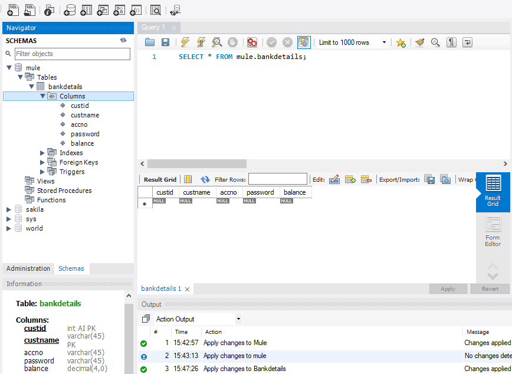
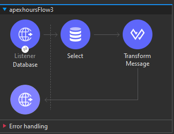
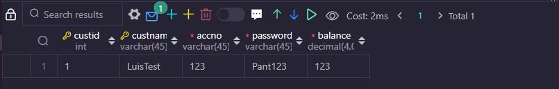
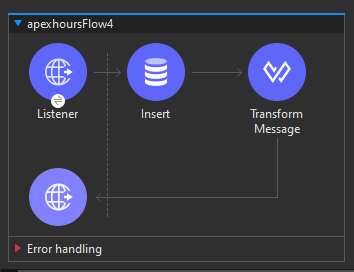

# Validación

El componente de validación en Mule 4 desempeña un papel crucial al verificar si el contenido de un mensaje cumple con los criterios especificados. Aquí se detallan aspectos importantes sobre su funcionamiento:

**Verificación de Contenido:**
El componente de validación examina el contenido de un mensaje para asegurarse de que cumpla con ciertos criterios predefinidos. Estos criterios podrían incluir condiciones específicas, como la presencia de ciertos datos o el formato correcto de la carga útil.

**Flujo de Ejecución:**
Si las condiciones de validación se cumplen, el flujo de ejecución continúa hacia los conectores o componentes siguientes. En caso contrario, si no se cumplen las condiciones, el componente de validación generará un error.

**Manejo de Errores:**
La generación de un error por parte del componente de validación indica que el mensaje no cumple con los requisitos esperados. Este error puede ser manejado en el flujo, permitiendo tomar medidas específicas en respuesta a la invalidación del mensaje.

**Ejemplo de Uso:**
En un escenario práctico, el componente de validación podría utilizarse para asegurarse de que ciertos campos obligatorios estén presentes en un mensaje o que los valores numéricos estén dentro de un rango específico.

```xml
<validation:is-true expression="#[payload.amount > 0]" doc:name="Check Amount">
  <validation:on-error-continue />
</validation:is-true>
```

En este ejemplo, el componente de validación verifica si el campo "amount" en la carga útil del mensaje es mayor que cero. Si se cumple la condición, el flujo continúa; de lo contrario, se maneja el error de forma que el proceso no se vea interrumpido.

El componente de validación es esencial para garantizar la integridad de los datos y la consistencia en el flujo de integración, permitiendo definir y hacer cumplir reglas específicas en función de los requisitos del negocio.

# Actividad, Parte 1

1. Abrimos nuestro proyecto de siempre de `Anypoint Studio`

2. Agregamos un nuevo `Listener` a nuestro canvas y en el valor de `Path` colocaremos `/validation`

3. En nuestro `Mule Palette` si buscamos `validation` veremos que nos muestra una serie de conectores distintos para validar distintos tipos de datos, en este caso toma el de `Is number` y colocalo depués del `Listener`

4. En su `Module configuration` da click en el `+` y luego presiona `ok` a la ventana que aparece

5. Entre el `Listener` y el `Is number` coloca un `Transform Message` con el siguiente código:
    ```properties
    %dw 2.0
    output application/json
    ---
    payload.id
    ```

6. Ahora coloca otro `Transform Message` frente al `Is number` y coloca el siguiente código:
    ```properties
    %dw 2.0
    output application/json
    ---
    "Success"
    ```

7. Volvemos al `Is number` para terminar de configurarlo de la siguiente manera:
    - `value:` **#[payload]**
    - `Number type:` **INTEGER**
    - `Message:` **This is NOT a number, Please check

8. Coloca un `Breakpoint` en el primer `Transform Message`

9. Guarda todo y prueba el programa, para probarlo usa un POST (funciona con cualquier metodo pero por buenas practicas sera con POST) y en el body coloca un `JSON` simple como:
    ```json
    {
        "id": 123
    }
    ```

> [!TIP]
> Si intentamos probar con un id tipo `"id": "1234"` igual funcionara y nos dara el mensaje de `success`, eso es por que como reconoce que son solo digitos hace una conversión interna, pero si es algo como `"id": "123a"`, fallará ya que detectara que hay un caracter presente, por ende ya no hara una conversión

# Antes de continuar...

En este punto es necesario instalar o tener instalado `MySQL` o cualquier otra base de datos para continuar, de manera personal usare `MySQL`

Además también debemos crear una cuenta de prueba en `Salesforce`

# Conector de Base de Datos

El conector de Base de Datos en Mule 4 facilita la interacción con sistemas de bases de datos, permitiendo realizar operaciones como consultas, actualizaciones, inserciones, y eliminaciones. Aquí se proporcionan detalles clave sobre su configuración y uso:

**Detalles de Configuración Obligatorios:**
- **Driver:** El controlador JDBC necesario para la conexión con la base de datos.
- **Host:** La dirección del servidor de la base de datos.
- **Puerto:** El puerto en el que el servidor de la base de datos está escuchando.
- **Usuario y Contraseña:** Las credenciales de acceso a la base de datos.
- **Base de Datos/Servicio/Instancia:** La identificación de la base de datos, servicio o instancia específica.
- **Texto de Consulta SQL:** La instrucción SQL que se ejecutará en la base de datos.

**Configuración por Defecto:**
Aunque el texto de la consulta SQL puede estar vacío, es importante tener en cuenta que dejarlo en blanco puede afectar el despliegue de la aplicación. Se recomienda proporcionar una consulta significativa.

**Cambios respecto a Mule 3:**
En Mule 4, se introdujo un cambio en la estructura del conector de Base de Datos. Mientras que en Mule 3 se utilizaba un único conector con distintas operaciones (Select, Update, Delete, Insert), en Mule 4, se tienen conectores separados para cada operación.

**Prueba de Conexión:**
El conector de Base de Datos permite realizar una prueba de conexión para verificar la conectividad exitosa con la base de datos antes de la ejecución del flujo.

**Tipo de Salida de la Consulta Select:**
Cuando se ejecuta una consulta Select, el resultado se presenta en forma de "Array". Si la consulta no devuelve filas, se obtiene un "Array" vacío en lugar de un resultado nulo.

**Ejemplo de Configuración:**
```xml
<db:select config-ref="Database_Config" doc:name="Select Data">
  <db:sql>SELECT * FROM employees WHERE department = #[payload.department]</db:sql>
</db:select>
```

En este ejemplo, se utiliza el conector de Base de Datos para realizar una consulta Select que selecciona todos los empleados de un departamento específico.

El conector de Base de Datos en Mule 4 simplifica la interacción con bases de datos, proporcionando una estructura modularizada y fácil de usar para realizar diversas operaciones.

# Actividad, Parte 2

1. Abre `MySQL` y prepara alguna base de datos que contenga alguna tabla, como por ejemplo:

<div align="center">
    
</div>

2. Similar a los `validations` si buscamos en nuestro `Mule Palette` la palabra `Database` nos apareceran multiples conectores, de momento nos interesa `Select`, arrastralo al canvas como un nuevo flujo

3. Agregamos un `Listener` en la parte de `Source` y le colocamos de _Path_: `/database` y en el _Display Name_: `Database`

4. Necesitamos configurar nuestro `Select` de la siguiente manera:
    1. Damos click en el `+` de `Connector Configuration`, en la ventana que aparece, en `Connection` seleccionamos nuestra base de datos, en este caso `MySQL`. 
    2. Puede que aparezca el cuadro de texto diciendo `MySQL JDBC Driver Please add the required driver`, de ser asi dar click en `Configure` -> `Add recomended libraries` -> `ok`. 
    3. En `host` simplemente colocamos `localhost` y en `port` el puesto que tengamos por default en la base de datos que por lo general es el `3306`. 
    4. El `Username` colocamos el que tengamos en la BDD, por lo general es `root`. En `Password` colocamos nuestra contraseña de nuestra BDD y finalmente en `database` podemos dejarlo en blnaco o colocar el nombre de la que vayamos a usar, pomo por ejemplo en mi caso le colocare `mule`. 
    5. Da click en `Test Connection` y si todo salio bien dara un mensaje de `Succesful`, de ser asi da click en `ok` para guardar la configuración
    6. Ahora en `SQL Query Text` debemos colocar algún código que necesitemos en este caso colocaré:
    ```sql
    SELECT * FROM mule.bankdetails;
    ```

5. Seguido del `Select` colocamos un `Transform Message` y colocamos simplemente:
    ```properties
    %dw 2.0
    output application/json
    ---
    payload
    ```

<div align="center">
    
</div>

6. Agregamos un `Breakpoint` al `Select`, guardamos y probamos el programa

7. En caso de que tengas la tabla vacia de tu BDD agrega algún valor como por ejemplo:

<div align="center">
    
</div>

8. Reintenta probar el programa para ver que nos retorna, como en este caso:
    ```json
    [
    {
        "password": "Pant123",
        "balance": 123,
        "accno": "123",
        "custid": 1,
        "custname": "LuisTest"
    }
    ]
    ```

9. Agrega otro renglon a la BDD y vuelve a probar, saldra algo similar a esto:
    ```json
    [
    {
        "password": "Pant123",
        "balance": 123,
        "accno": "123",
        "custid": 1,
        "custname": "LuisTest"
    },
    {
        "password": "Pent456",
        "balance": 44,
        "accno": "456",
        "custid": 2,
        "custname": "EmmanuelTest"
    }
    ]
    ```

> [!TIP]
> Recuerda que con lo aprendido en los bloques de DataWeave podremos modificar como nos debe mostrar la respuesta con el Transform Message

10. Le cambiamos el `Display Name` de nuetro `Listener` a `DatabaseSelect`

11. Creamos un nuevo diagrama, por lo que arrastra un nuevo `Listener` y dale el `Path` de `databaseInsert`

12. Ahora volviendo a buscar `Database` en el `Mule Palette`, selecciona el `Insert` y colocalo a lado del `Listener`

13. Como ya tenemos una configuración para el `Database` solo necesitas dar click en el input select del `Connector Configuration` y seleccionar el que ya creamos previamente

14. En `SQL Query Text` colocamos una query que nos permita **`insertar`** un nuevo valor, como:
    ```sql
    INSERT INTO mule.bankdetails (password, balance, accno, custname)
    VALUES ('pass12', 1234, '9475', 'Valery')
    ```

15. Pero si lo pensamos un poco, lo ideal sería que dichos valores se puedan aplicar dinamicamente, por ende vamos a realizar unos ajustes, para entender mejor como funcionará haremos lo siguiente:
    1. Debajo del `SQL Query Text` hay un `Input Parameters` mantenlo a la vista
    2. Tu Query debes modificarla para que se vea algo similar a esta:
    ```sql
    INSERT INTO mule.bankdetails (password, balance, accno, custname)
    VALUES (:password, :balance, :accno, :custname)
    ```
    3. Ahora da click en el _`Fx`_ del `Input Parameters` y escribe un código como este:
    ```yaml
    {
        password: "pass12",
        balance: 1234,
        accno: "9475",
        custname: "Valery",
    }
    ```
    
    Con lo realizado ya deberíamos ir captando como es que podemos pasar dinamicamente los valores, pero de momento continuaremos con el ejemplo como lo tenemos

    > [!IMPORTANT]
    > Es necesario que los VALUES a los que se les coloco `:` al principo de cada uno sean exactamente los mismos que colocamos en el `Input Parameters` para que funcione correctamente, otro dato es que los VALUES a los que les colocamos el `:` podemos nombrarlos como queramos pero por buenas practicas mantenemos el nombre de las columnas para evitar confusiones


17. Colocamos un `Transform Message` a lado del `Insert` y simplemente modificamos el código para que la salida sea JSON y con el payload como lo hicimos antes

<div align="center">
    
</div>

18. Agrega un `Breakpoint` en el `Insert`, guarda y prueba el programa. Para probarlo recomendría con un POST aun que no estemos mandando algún Body, revisa tu BDD para verificar que esta agregado el nuevo dato, ejemplo de respuesta que da indicando que todo salio bien:
    ```json
    {
    "generatedKeys": {},
    "affectedRows": 1
    }
    ```

19. Ahora modificaremos esto para que ahora si funcione dinamicamente, primero ejemplifiquemos como sera el Body de nuestra petición `POST`:
    ```json
    {
        "username": "Twilight",
        "account": "123478",
        "password": "pastwitest",
        "balace": 637
    }
    ```

20. Modificamos los `Input Parameters` del `Insert` quedando de la siguiente manera:
    ```yaml
    {
        password: payload.password,
        balance: payload.amount,
        accno: payload.accountNumber,
        custname: payload.username,
    }
    ```

21. Guardamos y probamos para ver que todo este funcionando como esperamos, revisa que la petición retorne el mensaje de exito visto en el paso 18 y revisa tu tabla de la BDD