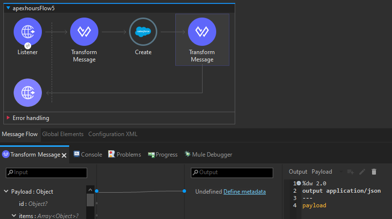
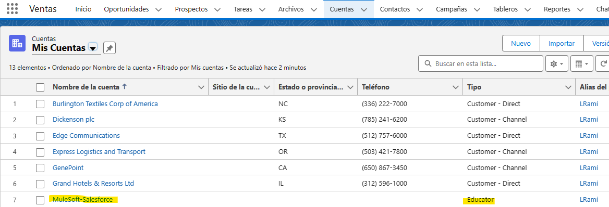
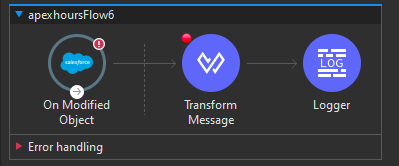
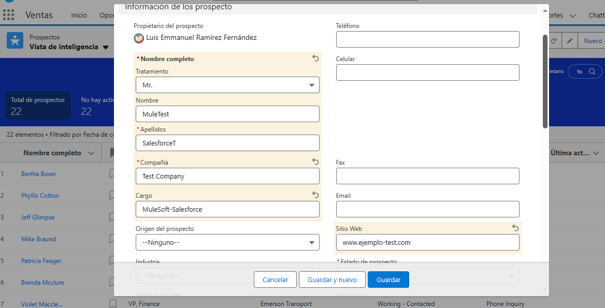
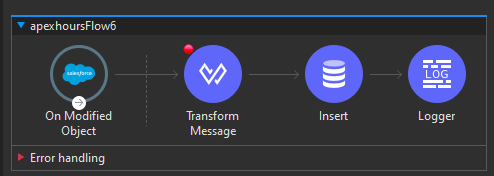
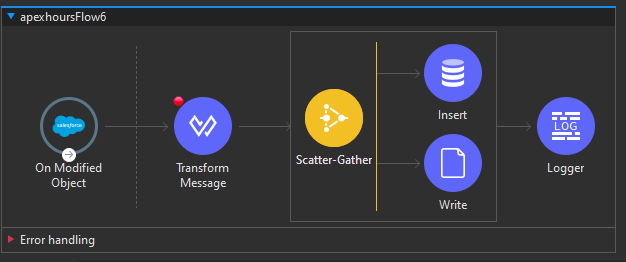

# Salesforce: Una Visión General

Salesforce es una plataforma líder en la industria que ofrece soluciones de gestión de relaciones con los clientes (CRM), brindando a las empresas herramientas poderosas para administrar y analizar las interacciones con sus clientes. Aquí te presento una visión general de Salesforce:

## ¿Qué es Salesforce?
Salesforce es una plataforma en la nube que proporciona una variedad de servicios y aplicaciones para mejorar la relación con los clientes, gestionar procesos comerciales y analizar datos de manera efectiva. Es conocida por su enfoque centrado en el cliente y su capacidad para adaptarse a las necesidades empresariales cambiantes.

## Características Principales
1. **CRM Integral:** Salesforce se destaca por su conjunto integral de herramientas CRM que abarcan ventas, marketing, servicio al cliente y análisis.
  
2. **Personalización:** La plataforma permite a las empresas personalizar sus instancias de Salesforce según sus procesos y flujos de trabajo específicos.

3. **Automatización:** Ofrece potentes funciones de automatización que agilizan tareas repetitivas y optimizan los procesos comerciales.

4. **Inteligencia Artificial (IA):** Salesforce incorpora capacidades de IA para analizar datos, prever tendencias y mejorar la toma de decisiones.

## Usuarios y Industrias
Salesforce es utilizado por una amplia gama de empresas, desde startups hasta grandes corporativos, en diversas industrias como tecnología, servicios financieros, atención médica, manufactura y más. Sus usuarios incluyen equipos de ventas, marketing, servicio al cliente, desarrolladores y ejecutivos.

## Servicios y Productos de Salesforce
1. **Sales Cloud:** Facilita la gestión de ventas, desde el seguimiento de clientes potenciales hasta la cerradura de acuerdos.

2. **Service Cloud:** Ofrece herramientas para brindar un servicio al cliente excepcional, desde la atención al cliente hasta la gestión de casos.

3. **Marketing Cloud:** Permite la creación y ejecución de campañas de marketing efectivas.

4. **Commerce Cloud:** Ayuda a construir y gestionar experiencias de compra en línea.

5. **Einstein Analytics:** Proporciona capacidades avanzadas de análisis e inteligencia artificial.

## Salesforce y MuleSoft
La integración entre Salesforce y MuleSoft es clave para aprovechar al máximo ambas plataformas. MuleSoft permite conectar Salesforce con otros sistemas y aplicaciones, garantizando una experiencia de usuario fluida y una visión completa de los datos en toda la empresa.

En resumen, Salesforce se ha convertido en un pilar fundamental para muchas organizaciones, ofreciendo soluciones integrales para la gestión eficaz de relaciones con clientes y el impulso de operaciones comerciales. Su integración con MuleSoft potencia la conectividad y la interoperabilidad en el panorama empresarial actual.

# Integración con Salesforce en Mule 4

La integración con Salesforce en Mule 4 permite conectar y realizar operaciones con la plataforma Salesforce, que es ampliamente utilizada para la gestión de relaciones con clientes (CRM). Aquí se abordan aspectos clave de la integración:

## Conector Salesforce:

Mule 4 cuenta con un conector específico para Salesforce, que simplifica la interacción con las API de Salesforce. Este conector proporciona operaciones para realizar consultas, insertar, actualizar y eliminar registros, así como para invocar acciones personalizadas en Salesforce.

## Detalles de Configuración:

La configuración del conector Salesforce requiere detalles esenciales, como el nombre de usuario, la contraseña, el token de seguridad, y el ID del consumidor y secreto del consumidor, que se obtienen al registrar la aplicación en Salesforce. Estos detalles garantizan una conexión segura y autenticada.

## Operaciones Comunes:

- **Consulta (Query):** Permite recuperar datos de objetos en Salesforce utilizando lenguaje SQL-like SOQL.
- **Inserción (Insert):** Agrega nuevos registros a un objeto específico en Salesforce.
- **Actualización (Update):** Modifica los valores de registros existentes en Salesforce.
- **Eliminación (Delete):** Borra registros de un objeto en Salesforce.

## Streaming y Eventos:

Mule 4 ofrece capacidades de streaming que permiten manejar grandes volúmenes de datos al integrarse con Salesforce. Además, se pueden configurar eventos de Salesforce para recibir notificaciones en tiempo real sobre cambios en los datos.

## Ejemplo de Operación:

```xml
<salesforce:query config-ref="Salesforce_Config" query="SELECT Id, Name FROM Account WHERE Industry = 'Technology'" doc:name="Salesforce Query"/>
```

En este ejemplo, se utiliza la operación de consulta para recuperar los identificadores y nombres de cuentas en Salesforce que pertenecen a la industria "Technology".

La integración con Salesforce en Mule 4 facilita la creación de flujos de trabajo robustos y flexibles que interactúan de manera eficiente con los datos almacenados en la plataforma Salesforce, permitiendo una gestión efectiva de la información del cliente y procesos de negocio.

# Actividad, Parte 1

1. Nos aseguramos de que ya tenemos nuestra cuenta de `Salesforce for Developers` creada y seguido de eso abrimos nuestro proyecto de Mule

2. Agregamos un nuevo `Listener` cuyo `Path` tendra el valor de `/salesforce`

3. En nuestro `Mule Palette` podemos buscar `salesforce` y apareceran una gran cantidad de conectores que podremos usar, de momneto solo tomemos el `Create` y colocalo junto al `Listener`

> [!NOTE]
> Para saber más sobre dicho conector da click [aqui](./Notas_Extras/ConectoresMule.md/#salesforce---create)

4. Ahora tendremos que configurar nuestro conector de la siguiente manera:
    1. `Connector Configuration:` Damos click en el `+` y nos abrira una ventana nueva donde en `Connection` tenemos distintas opciones de autenticación, pero de momneto dejaremos la que esta por default la `basic`. Seguido de eso esta `Username` y `Password`, los cuáles son simplemente tu cuenta se `salesforce`. El `Security Token` en caso de no recordarlo o tenerlo guardado, ve a la pagina de `salesforce` -> `click foto de perfil` -> `Configuración` -> `Mi información personal (panel izquierdo)` -> `Restablecer Token de Seguridad`, Con eso se enviara un correo con un token de seguridad, copialo y pegalo. En cuanto a `Authorization URL` aparece por si solo asi que no debes mover lo que te coloque. Revisa que todo vaya en orden dando click en `Test connection` y finalmente presiona `ok`
    2. En `Type` tenemos una larga lista de opciones, de momento seleccionamos `Cuenta (Account)`

5. Agregamos 2 `Transform Message`, uno entre el `Listener` y el `Create` y otro después del `Create`. Como el `Create` solo acepta `Java` el código del primer `Transform Message` debe ser algo asi:
    ```properties
    %dw 2.0
    output application/java
    ---
    payload
    ```
    Mientras que el segundo `Transform Message` simplemente será:
    ```properties
    %dw 2.0
    output application/json
    ---
    payload
    ```
    finalmente agrega un breakpoint al primer `Transform Message`

6. Si vemos nuestra plataforma de `Salesforce` veremos un menú con diversas secciones, vamos a la de `Cuentas`, en escensia lo que hara el conector `Create` es crear una de estas ya que en `type` colocamos `Account`, pero necesitamos saber que información es necesaria. Para ello damos click en el `engranaje de configuración justo a la campana de notificación` y seleccionamos `Confiuración` (el icono azul), nos llevara a otro panel de control, en este seleccionamos la opción `Gestor de objetos` lo que nos desplegara una lista, buscamos `Cuenta` y damos click. Finalmente damos click en `Campos y Relaciones` dondé veremos todos los campos a detalle.

7. Si nos fijamos una de las columnas se titula `Nombre de Campo` esos son los que vamos a necesitar, solo debemos buscar en `Etiqueta de Campo` lo que necesitamos y revisar su  `Nombre de Campo`, en este caso nos intera el `Nombre de la Cuenta`, `Tipo` y `Sitio web`, revisamos sus `Nombres de campos` y los utilizaremos para hacer nuestras pruebas con `Postman` o la aplicación que prefieras con el siguiente payload:
    ```json
    [    
        {
            "Name": "MuleSoft-Salesforce",
            "Type": "Educator",
            "Website": "www.ejemploweb.com"
        }
    ]
    ```
    Debe llevar si o si `[]` ya que si no dara error por que `Create` solo acepta `Arrays`

<div align="center">
    
</div>

8. Probamos y veamos que nos retorna algo como esto:
    ```json
    {
        "id": null,
        "items": [
            {
                "exception": null,
                "message": null,
                "payload": {
                    "success": true,
                    "id": "001Hs000036hgk4IAA",
                    "errors": []
                },
                "id": "001Hs000036hgk4IAA",
                "statusCode": null,
                "successful": true
            }
        ],
        "successful": true
    }
    ```

9. Ahora, con eso deberíamos haber creado una cuenta, por lo que revisando la pagina de `Salesforce` en la pestaña de `Cuentas` y asegurandonos que este seleccionada la opción de `Mis Cuentas` o `Todas las cuentas` debería aparecer la que creamos:

<div align="center">
    
</div>

10. Ahora usaremos un nuevo conector de nombre `On Modified Object`, por lo que arrastralo a el canvas para generar un nuevo flujo, como vez no siempre es necesario un `Listener`

> [!NOTE]
> Para saber más sobre dicho conector da click [aqui](./Notas_Extras/ConectoresMule.md/#salesforce---on-modified-object)

11. Necesitamos configurarlo por lo que realizamos lo siguiente:
    1. En `Connector Configuration` debería aparecer la configuración que ya creamos con `Create`
    2. En `Object Type` selecciona `Prospecto (Lead)`
    3. En `Frecuency` le pondremos el valor de `10`
    4. Finalmente en `Time Unit` la cambiamos a `segundos`

12. Coloca un `Transform Message` jusnto al `OMO` y simplemente que el código muestre el payload:
    ```properties
    %dw 2.0
    output application/json
    ---
    payload
    ```
    agregale un `breakpoint`

13. Como no es una petición HTTP haremos uso de un `Logger` para ver el payload asi que coloca uno junto al `Transform Message` y simplemente en en `Message` da click en _`Fx`_ y escribe `#[payload]`

<div align="center">
    
</div>

> [!NOTE]
> Si no compila o da error el `OMO` borralo y vuelve a configurarlo

14. Guarda y corre el programa

15. En la pagina de `Salesforce` ve a la pestaña de `Prospectos` y comienza a crear uno nuevo, solo asegurate de llenar los parametros obligatorios:

<div align="center">
    
</div>


16. Guardalo y regresa a `Anypoint` ya sea que lo veas en la consola o en el modo debug debemos tener una respuesta en el `Logger` de este estilo:
    ```shell
    INFO  2024-01-24 15:03:39,694 [[MuleRuntime].uber.09: [apexhours].apexhoursFlow6.CPU_INTENSIVE @6d587bdb] [processor: apexhoursFlow6/processors/1; event: 0c488bf0-bafc-11ee-80aa-683e2650e39a] org.mule.runtime.core.internal.processor.LoggerMessageProcessor: {
        "LastModifiedDate": "2024-01-24T21:03:36.000Z",
        "Company": "Test Company",
        "Email": null,
        "Address": {
                "country": "Mexico",
                "city": "Lerma",
                "countryCode": null,
                "street": "Random Address",
                "latitude": null,
                "postalCode": "78787",
                "geocodeAccuracy": null,
                "stateCode": null,
                "state": "Mexico",
                "longitude": null
            },
        "Latitude": null,
        "ProductInterest__c": null,
        "type": "Lead",
        "MobilePhone": null,
        "Name": "MuleTest SalesforceT",
        "Industry": null,
        "CreatedById": "005Hs00000ECbyAIAT",
        "SICCode__c": null,
        "Street": "Random Address",
        "DandbCompanyId": null,
        "PhotoUrl": "/services/images/photo/00QHs00001ybvi2MAA",
        "ConvertedOpportunityId": null,
        "MasterRecordId": null,
        "IndividualId": null,
        "Status": "Working - Contacted",
        "IsDeleted": "false",
        "ConvertedAccountId": null,
        "IsConverted": "false",
        "LastViewedDate": "2024-01-24T21:03:38.000Z",
        "City": "Lerma",
        "Longitude": null,
        "CleanStatus": "Pending",
        "LeadSource": null,
        "GeocodeAccuracy": null,
        "Primary__c": null,
        "State": "Mexico",
        "CreatedDate": "2024-01-24T21:03:35.000Z",
        "Country": "Mexico",
        "Id": "00QHs00001ybvi2MAA",
        "LastName": "SalesforceT",
        "AnnualRevenue": null,
        "Jigsaw": null,
        "EmailBouncedDate": null,
        "Description": null,
        "ConvertedDate": null,
        "Rating": null,
        "PostalCode": "78787",
        "Website": "www.ejemplo-test.com",
        "LastReferencedDate": "2024-01-24T21:03:38.000Z",
        "NumberOfEmployees": null,
        "CompanyDunsNumber": null,
        "Salutation": "Mr.",
        "ConvertedContactId": null,
        "OwnerId": "005Hs00000ECbyAIAT",
        "Phone": null,
        "NumberofLocations__c": null,
        "IsPriorityRecord": "false",
        "EmailBouncedReason": null,
        "FirstName": "MuleTest",
        "IsUnreadByOwner": "false",
        "Title": "MuleSoft-Salesforce",
        "SystemModstamp": "2024-01-24T21:03:36.000Z",
        "CurrentGenerators__c": null,
        "LastActivityDate": null,
        "Fax": null,
        "LastModifiedById": "005Hs00000ECbyAIAT",
        "JigsawContactId": null
    }
    ```

17. Ahora, como recordaremos antes hemos visto como insertar datos a la BDD, por lo que vamos a crear una nueva tabla: 
    ```sql
    CREATE TABLE SalesforceFields(  
        id int NOT NULL PRIMARY KEY AUTO_INCREMENT COMMENT 'Primary Key',
        name VARCHAR(255),
        company VARCHAR(100),
        status VARCHAR(100),
        website VARCHAR(100),
        city VARCHAR(45)
    );
    ```

18. Agregamos un `Insert` entre el `Transform Message` y el `Logger` y colocamos la siguiente Query:
    ```sql
    INSERT INTO mule.salesforcefields (name, company, status, website, city)
    VALUES (:name, :company, :status, :website, :city);
    ```

19. Seguido de eso agregamos los `Input Parameters`:
    ```yaml
    {
        name: payload.Name,
        company: payload.Company,
        status: payload.Status,
        website: payload.Website,
        city: payload.City
    }
    ```

> [!NOTE]
> No olvidar agregar el Connector Configuration que ya previamente hemos creado en lecciones anteriores

<div align="center">
    
</div>

20. Guardamos y corremos el programa, probamos creando un nuevo `Prospecto`, asegurandonos que no nos falten los datos que queremos en la BDD y observamos el resultado ya sea haciendo debug o revisando la tabla que creamos viendo los datos almacenados

21. Ahora intentaremos algo, a parte de que se guarde en la BDD vamos a generar un excel, para ello usaremos `Scatter-Gather` y lo colocaremos antes de nuestro `Insert`

22. Colocamos nuestro `Insert` dentro del `Scatter-Gather` y ahora buscamos un nuevo conector, si buscamos `File` apareceran multiples conectories, selecciona el de `Write` y colocalo juto al `Insert` dentro del `Scatter-Gather`

> [!NOTE]
> Para saber más sobre dicho conector da click [aqui](./Notas_Extras/ConectoresMule.md/#file---write)

23. Comenzamos a configurar el `Write`
    1. En `Connector Configuration` solo da click `+` y luego en `ok`
    2. En `Path` solo seleccionamos donde queremos guardar el archivo, por ejemplo: `C:\Users\sps\OneDrive - SPS\Documentos\Cursos\1 - Mulesoft\Codigos\apexhours\SalesforceLeads.csv`
    3. En `Content` agregamos algo como: `output application/csv --- [payload]`

<div align="center">
    
</div>

24. Guardamos y volvemos a probar corriendo el programa y agregando un nuevo Prospecto desde `Salesforce`

> [!WARNING]
> Al parecer hay un error al momento de crear el csv, debo revisarlo después