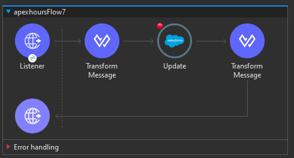

# Actividad, Parte 1

1. Creamos un nuevo flujo similar al primero que creamos en el bloque anterior [de la primera actividad](./12_Salesforce_Int_Part1.md/#actividad-parte-1), dondé en vez de usar el `create` utilizaremos el `update` y en el path del listener colocaremos `/salesforceupdate`

<div align="center">
    
</div>

> [!NOTE]
> Para saber más sobre dicho conector da click [aqui](./Notas_Extras/ConectoresMule.md/#salesforce---update)

2. Para poder probarlo necesitaremos el `id` del usuario que vamos a modificar, para ello si hiciste una copia del `json` que nos retorno al momneto de crearlo veremos ahí el `id`:
    ```json
    {
        "id": null,
        "items": [
            {
                "exception": null,
                "message": null,
                "payload": {
                    "success": true,
                    "id": "001Hs000036hgk4IAA",
                    "errors": []
                },
                "id": "001Hs000036hgk4IAA",
                "statusCode": null,
                "successful": true
            }
        ],
        "successful": true
    }
    ```

    siendo en este caso `001Hs000036hgk4IAA`. Pero de no tenerlo puedes ir a la página de `salesforce` -> `Cuentas` y seleccionar la que creamos y si revisas la `URL` veras que ahí también aparece su `id`

<div align="center">
    
</div>

3. Una vez tengas la `id` de la cuenta a modificar en tu `postman` utiliza el nuevo path que creamos y prueba enviando un cuerpo similar a cuando creamos dicha cuenta, pero modificando un par de cosas como en este caso que cambiaremos el nombre y el sitio web:
    ```json
    [
        {
            "id": "001Hs000036hgk4IAA",
            "Name": "MuleSoft-Modificado",
            "Type": "Educator",
            "Website": "www.ejemplowebmod.com"
        }
    ]
    ```

4. Antes procura guardar todo y correr el programa,luego has la prueba en el `postman` y finalmente revisa la pagina de `salesforce` para verificar que la cuenta fue modificada

> [!TIP]
> Puedes enviar uno o mas elementos a modificar, osea si tienes 10 cuentas y quieres modificar las 10 en un solo llamado, lo puedes hacer

5. Ahora imaginemos que no tenemos acceso al `dashboard` de la pagina de `salesforce`, para obtener el `id` y otros datos que puedan sernos de importancia podemos hacer uso del conector `Query` pero de `Salesforce`, para ello agrega un nuevo listener al canvas

> [!NOTE]
> Para saber más sobre dicho conector da click [aqui](./Notas_Extras/ConectoresMule.md/#salesforce---query)

6. Busca y coloca justo el listener el conector `Query` de `Salesforce`

7. Coloca un `Transform Message` junto al `Query`

8. El `path` del `Listener` es `/salesforcequery`, el `Transform Message` es solo una salida json del payload y en cuanto al `Query` coloca el siguiente código:
    ```sql
    SELECT FIELDS(ALL) FROM Account LIMIT 200
    ```

9. Guarda, corre el programa y prueba con tu `postman`

10. Claramente es mucha la información que nos retorna, vamos a reducirla cambiando la Query para que solo nos retorne un par de datos
    ```sql
    SELECT Name, Id, Website FROM Account LIMIT 200
    ```

    guarda y vuelve a probar

11. Ahora usaremos el conector `Upsert` de `Salesforce`, crea un flujo similar al `Update`

> [!NOTE]
> Para saber más sobre dicho conector da click [aqui](./Notas_Extras/ConectoresMule.md/#salesforce---upsert)

12. El `path` en este caso será `/salesforceupsert`, los `Transform Message` como podremos intuir el primero es un java con el payload y el últino es una salida json con el payload

13. En cuanto a la configuración del `Upsert` tenemos algo nuevo, pero antes de profundizar en ello, necesitamos de un `id externo` el cuál podemos crear siguiendo siguiente [video](https://www.youtube.com/watch?v=yh5XWr7O2E0&list=PL61bQcdxsK6_f5GDV3f2STtMTS3nYIlYO&index=19), a partir del minuto `18:20`

14. Una vez realizado podemos seguir con la configuración del `Upsert`, el cuál en `Object type` solo ocupaos colocar que es `Cuenta (Account)` y en `External id field name` debería aparecer como opción el `id externo` que recien creamos

15. Guarda, corre el programa y pruebalo con un cuerpo como este:
    ```json
    [
        {
            "RolNo__c": "MuleSoftIdExt",
            "Name": "test-mule",
            "Type": "Educator",
            "Website": "www.ejemplowebtest.com"
        }
    ]
    ```

    notese que incluimos el `id externo` con el nombre de campo que nos aparece en nuestro panel de control, le damos el valor que queramos, de no tenerlo fallará, pero en caso de que indique `succes` revisa el panel de control y busca la nueva cuenta que acabamos de crear, da click en `detalles`, verás que aparece nuestro `RolNo` y si revisas la primera cuenta que creamos dicho campo no tendrá nungun valor

16. Ahora vuelve a hacer la solicitud manteniendo el `id externo` y solo cambia por ejemplo el nombre, veras que funciona, ya que al final el punto de Upsert es que si existe lo modifica, de no existir lo crea

---

#### Para saber más sobre un par de conectores extra ver a partir del minuto 28:30 del siguiente [video](https://www.youtube.com/watch?v=yh5XWr7O2E0&list=PL61bQcdxsK6_f5GDV3f2STtMTS3nYIlYO&index=19).