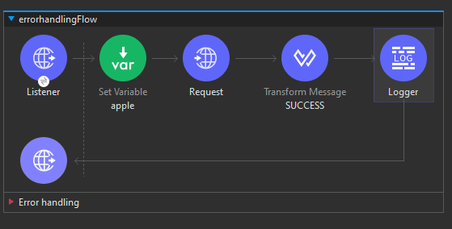
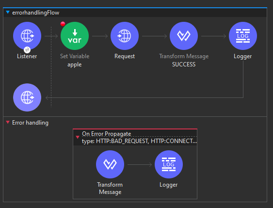
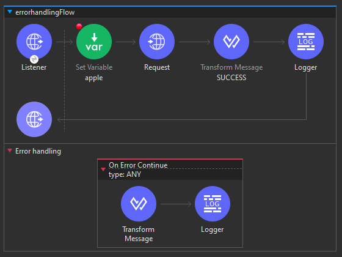
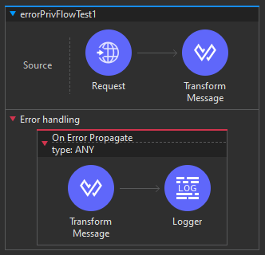

# Error Handling in Mule 4 Mulesoft

El manejo de errores en Mule 4 de MuleSoft es una parte esencial de la construcción de integraciones robustas y confiables. Permite a los desarrolladores anticipar y gestionar posibles situaciones imprevistas durante la ejecución de flujos y subflujos. Al implementar estrategias efectivas de manejo de errores, los desarrolladores pueden mejorar la resiliencia de sus aplicaciones, garantizando respuestas controladas y descriptivas en caso de fallos. Desde la identificación de excepciones hasta la ejecución de acciones específicas frente a situaciones de error, el manejo de errores en Mule 4 es una herramienta poderosa para garantizar la estabilidad y el rendimiento de las integraciones.

## ¿Qué es un Error?

En Mule 4, un error se produce cuando ocurre un evento inesperado durante el procesamiento de un flujo de integración. Este puede ser el resultado de diversas situaciones, como problemas de conectividad, datos incorrectos o cualquier otro escenario imprevisto que interrumpa el flujo normal de ejecución.

## Manejo de Excepciones:

El manejo de excepciones es el proceso de responder a eventos inesperados que pueden surgir durante la ejecución de un programa informático. En Mule 4, se implementa una sólida infraestructura de manejo de errores para abordar y gestionar estas excepciones de manera efectiva.

## Niveles de Manejo de Errores en Mule 4:

1. **Nivel de Proyecto con Manejador de Errores Predeterminado:**
   - Mule 4 proporciona un manejador de errores predeterminado a nivel de proyecto que puede capturar y procesar excepciones generales.

2. **Nivel de Proyecto con Manejador de Errores Global Personalizado:**
   - Además del manejador predeterminado, los desarrolladores pueden definir un manejador de errores global personalizado a nivel de proyecto para abordar situaciones específicas.

3. **Nivel de Flujo con Manejo de Excepciones:**
   - A nivel de flujo, el manejo de excepciones se puede realizar utilizando:
      - **On Error Continue:** Permite al flujo continuar ejecutándose después de un error, ignorando la excepción.
      - **On Error Propagate:** Propaga la excepción al siguiente elemento del flujo o a un manejador de errores superior.
      - **Raise Error:** Permite generar manualmente una excepción en el flujo.

4. **A Nivel de Flujo o a Nivel de Procesador con Ámbito Try:**
   - Se puede utilizar el ámbito 'Try' para envolver secciones específicas de un flujo, permitiendo un manejo más granular de excepciones.

## Objeto de Error:

Cuando se produce un error en un flujo, se crea un objeto de error que contiene diversas propiedades, como `error.description` y `error.errorType`. La propiedad `error.errorType` es una combinación de un espacio de nombres y un identificador, como en el caso de `HTTP:UNAUTHORIZED`, donde el espacio de nombres es `HTTP` y el identificador es `UNAUTHORIZED`. Mule utiliza esta información para identificar y dirigir la excepción a bloques específicos dentro del manejador de errores.

## Manejo de Errores en Sub-Flujos en Mule 4:

Los sub-flujos en Mule 4 no cuentan con un ámbito específico para el manejo de errores, a diferencia de los flujos y flujos privados. En un flujo o flujo privado, se tiene la flexibilidad de incorporar bloques de manejo de errores como 'On-Error-Propagate' y 'On-Error-Continue' dentro del bloque "Error Handling".

### En Flujos y Flujos Privados:
- Dentro de un flujo o un flujo privado, los bloques de manejo de errores, como 'On-Error-Propagate' y 'On-Error-Continue', pueden ubicarse dentro del bloque "Error Handling". 
- Independientemente de que se utilice 'Propagate' o 'Continue', Mule ejecutará todos los componentes dentro de ese bloque.

### Consideraciones Importantes:
- Es fundamental recordar que un error solo se dirigirá al manejo de errores si se identifica que el tipo de error (`errorType`) es manejado. Es decir, si el bloque de manejo de errores específicamente aborda el tipo de error asociado.

### Flujo de Ejecución:
1. **Identificación del Tipo de Error:**
   - Cuando se produce un error, Mule verifica el tipo de error (`errorType`) asociado.
  
2. **Búsqueda en el Manejo de Errores:**
   - Mule busca un bloque de manejo de errores que aborde el tipo específico de error.

3. **Ejecución del Bloque de Manejo de Errores:**
   - Si se encuentra un bloque correspondiente, Mule ejecuta todos los componentes dentro de ese bloque.

Este enfoque permite una gestión precisa de diferentes tipos de errores en contextos específicos, mejorando la claridad y la eficacia del manejo de excepciones en flujos y flujos privados. Es vital comprender la identificación y el enrutamiento de errores para garantizar un manejo adecuado y una respuesta controlada ante situaciones inesperadas.

## Reglas Esenciales para el Manejo de Errores en Mule 4

El manejo de errores en Mule 4 implica comprender las reglas fundamentales que rigen el comportamiento de los bloques 'On-Error-Propagate' y 'On-Error-Continue'. Estas reglas proporcionan directrices claras sobre cómo los flujos gestionan y responden a errores, influyendo en la continuidad del flujo y la propagación de errores a flujos llamadores. A continuación, se detallan las tres reglas clave que definen este proceso en Mule 4.

1. **Regla 1: Evaluación del Manejo de Errores**
   - Examine la presencia de bloques de manejo de errores en el flujo.
   - Verifique si el tipo de error específico está manejado para determinar el siguiente curso de acción.

2. **Regla 2: Ejecución con On-Error-Propagate y On-Error-Continue**
   - Distinga entre 'On-Error-Propagate' y 'On-Error-Continue'.
   - Ambos bloques ejecutan todos los componentes internos, con impactos específicos en la propagación y continuidad del error.

3. **Regla 3: Comportamiento Detallado**
   - Detalle el comportamiento distintivo de 'On-Error-Propagate' y 'On-Error-Continue'.
   - Explore cómo cada bloque afecta la propagación del error y la continuidad del flujo llamador.

Estas reglas proporcionan un marco esencial para entender el manejo de errores en Mule 4, destacando las interacciones entre diferentes bloques y su impacto en la ejecución del flujo.

## Regla 1: Manejo de Errores en Mule 4

La Regla 1 se enfoca en el manejo de errores y busca garantizar una gestión efectiva de situaciones inesperadas en flujos y flujos privados de Mule 4.

### Pasos Clave:

1. **Revisar la Configuración de Manejo de Errores:**
   - Verificar la presencia de bloques de manejo de errores, como 'On-Error-Propagate' y 'On-Error-Continue', en el bloque "Error Handling".

2. **Evaluar el Manejo del Tipo de Error (`errorType`):**
   - Asegurarse de que el tipo de error específico esté siendo manejado en los bloques de manejo de errores.
   
3. **Uso del Manejo de Errores Predeterminado:**
   - En caso de que el tipo de error no esté manejado en bloques específicos, Mule recurre al manejo de errores predeterminado.

4. **Manejo por Defecto en Flujos no Llamados por Otros Flujos:**
   - Si el flujo no es invocado por ningún otro flujo y no se establece un valor manualmente, se utilizará el manejo de errores predeterminado. Esto podría resultar en la presentación de un valor predeterminado en la respuesta de error, con un código de estado 500 (Bad Default).

5. **Manejo al Ser Invocado por Otro Flujo:**
   - Si el flujo es llamado por otro flujo y no maneja el tipo de error específico, se elevará como un error al flujo que lo invoca.

Esta regla destaca la importancia de configurar adecuadamente el manejo de errores, identificar los tipos de errores que se deben manejar y comprender las implicaciones de no manejar un error en flujos de Mule 4. Un manejo proactivo de errores contribuye a una ejecución más robusta y controlada de las aplicaciones de integración.

## Regla 2: Manejo de Errores Continuado vs. Propagado en Mule 4

La Regla 2 se centra en la dinámica del manejo de errores en flujos de Mule 4, específicamente cuando se detecta un tipo de error manejado (conforme a la Regla 1) y se evalúa si el manejo debe ser continuado o propagado.

### Pasos Clave:

1. **Existencia de Manejo de Errores:**
   - Verificar la presencia de bloques de manejo de errores en el flujo, confirmando que el tipo de error específico está siendo manejado.

2. **Evaluación de On-Error-Continue y On-Error-Propagate:**
   - Determinar si el bloque de manejo de errores contiene componentes 'On-Error-Continue' o 'On-Error-Propagate'.

3. **Ejecución de Componentes Dentro del Bloque:**
   - Independientemente de ser 'On-Error-Continue' o 'On-Error-Propagate', Mule ejecutará todos los componentes dentro de ese bloque de manejo de errores.

Esta regla destaca la ejecución ininterrumpida de componentes dentro de bloques de manejo de errores específicos. Ya sea que el manejo continúe o propague el error, Mule asegura la ejecución de todos los componentes definidos en el bloque. Esto permite una gestión controlada de errores mientras se mantiene la funcionalidad esencial del flujo.

## Regla 3: Comportamiento de On-Error-Propagate y On-Error-Continue en Mule 4

La Regla 3 aborda el comportamiento específico de los bloques 'On-Error-Propagate' y 'On-Error-Continue' en el manejo de errores en Mule 4. Se centra en cómo estos bloques influyen en el flujo de ejecución y cómo impactan en el flujo llamador en caso de un error manejado.

### Consideraciones Clave:

1. **Manejo con On-Error-Propagate:**
   - Si el error es manejado utilizando 'On-Error-Propagate', se propaga un error de regreso al flujo llamador.
   - El flujo llamador recibirá y gestionará este error propagado.

2. **Manejo con On-Error-Continue:**
   - Si el error es manejado con 'On-Error-Continue', no se propaga un error de regreso al flujo llamador.
   - La ejecución continúa con el siguiente procesador después de 'flow-ref' y procede con el proceso posterior.
   - No se avanza a otros procesadores en el mismo flujo donde se manejó el error ('On-Error-Continue').

3. **Comportamiento Similar en un Único Flujo:**
   - En un escenario con un solo flujo, 'On-Error-Propagate' y 'On-Error-Continue' pueden comportarse de manera similar.
   - Ambos casos siguen adelante después de 'flow-ref', pero con diferencias en los códigos de estado (200 para 'On-Error-Continue' y 500 para 'On-Error-Propagate').
   - Importante: Aunque es 'On-Error-Continue', no avanza a procesadores posteriores en el mismo flujo donde se manejó el error.

Estos puntos resaltan las distintas trayectorias que siguen los flujos después de gestionar errores con 'On-Error-Propagate' y 'On-Error-Continue', brindando claridad sobre cómo se comportan en diferentes situaciones y estructuras de flujo.

# Actividad, Parte 1

1. Crearemos un nuevo proyecto en nuestro `Anypoint` con el nombre de `errorHandling`

2. Agrega al canvas un `Listener` y configuralo como ya hemos visto en los primeros modulos, solo en `Path` coloca `/error1`

3. En las mismas configuraciones del `Listener` tenemos una serie de pestañas, entre ellas `Responses` da click ahí

4. Analizaremos que tenemos 2 secciones, una para el response exitoso y otra para el `error response` no moveremos nada de momento, solo fue para hechar un vistazo

5. Colocamos un `Set Variable` junto al `Listener` y le damos el nombre de `fruit` y valor de `apple`

6. Colocamos un `Request`, dale una `Configuración` por default, en cuanto a su `URL` coloca cualquier cosa ya que provocaremos un error

7. Ahora coloca un `Transform Message` junto al `Request` y que su código sea simplemente:
    ```properties
    %dw 2.0
    output application/json
    ---
    "SUCCESS"
    ```
    renombra el `Transform Message` como `SUCCESS` de igual manera

8. Coloca un `Logger` junto al `Transform Message` y simplemente en `Message` coloca `#[payload]`

9. Agrega un `brakpoint` en el `Set Variable` y también renombralo como `apple`

<div align="center">
    
</div>

10. Guarda, corre el programa en modo `debug` y prueba con tu `postman` para ver el error que generamos

11. Una vez que revisamos que nos da el `debug` volvemos a la visa de edición

12. Agregamos dentro de nuestro diagrama en la sección de `Error handling` el conector `On Error Propagate (OEP)`

13. Si revisamos bien cuando hicimos debug nos aparecio en `errorType` un `HTTP:CONNECTIVITY`, por lo que en la configuración del `OEP` en la parte de `type` podemos seleccionarlo, pero primero probaremos algo antes, selecciona `HTTP:BAD_REQUEST`

14. Coloca un `Transform Message` dentro del `OEP` y en su código simplemente coloca:
    ```properties
    %dw 2.0
    output application/json
    ---
    "Error occured in main flow"
    ```

15. Si lo guardamos, corremos y probamos jamás entrara a nuestro `OEP` por lo mencionado en el paso `13`

16. Si te fijaste vien podíamos seleccionar más de un error a manejar en nuestro `OEP` asi que simplemente en `type` agrega el error que deberíamos estar manejando `HTTP:CONNECTIVITY`

> [!TIP]
> En `type` la opción de `ANY` es que por default va a manejar cualquier error sin necesidad de especificar

17. Guarada, corre el programa y pruebalo

18. Te daras cuenta que en tu `Postman` no estamos viendo el mensaje que pusimos en el `Transform Message`, eso es por lo que antes vimos en la configuración del `Listener`, para ver el mensaje selecciona en la config. del `Listener` -> `Responses` y en `Error Response` cambia el código que tiene por simplemente `payload`

<div align="center">
    
</div>

> [!NOTE]
> El Logger que vemos dentro del `OEP` simplemente lleva por código `[#payload]` no es necesario tenerlo

19. Vuelve a probar el programa

> [!IMPORTANT]
> Si prestate atención cuando haciamos la prueba en `postman` nos daba un error `500` la respuesta, esto es importante para notar la diferencia de lo que haremos a continuación.

20. Cambiaremos nuestro `OEP` por un `On Error Continue (OEC)`, en `type` dejaremos el `ANY` y el `Transform Message` y `Logger` los mantendremos intactos dentro de este

<div align="center">
    
</div>

21. Prueba de nuevo el programa y veras que ahora el postman no da un `500` si no que da un `200` de `Success`

22. Para entender mejor la diferencia haremos algo, coloca un `Flow` y nombralo como gustes, dentro de este agrega el `Request` del diagrama principal, agrega un `Flow Reference` en su lugar y selecciona el `Flow` que acabamos de crear, para asi tener un `Flow privado`

23. En el nuevo flow agrega un `Transform Message` junto al `Request`, no importa su código, si quieres haz que sea una salida json con un mensaje generico

24. En su `Error handling` agrega un `OEP` con el type `ANY` y un `Logger` que muestre el `payload`

<div align="center">
    
</div>

25. Probamos el código

26. Ahora si en el `Flow Privado` cambiamos el `OEP` por un `OEC` sucederá que veremos el mensaje que hayamos colocado en el `Transform Message` junto al `Listener` y en el postman veremos el mensaje de `SUCCESS`