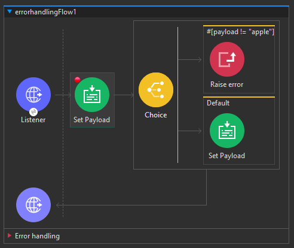
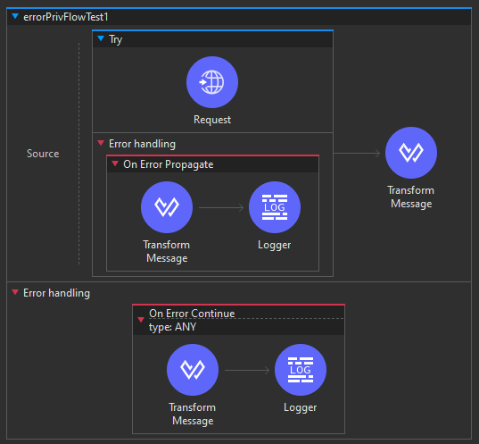

# Generación Controlada de Errores con `Raise Error` en Mule 4

En Mule 4, el componente central `Raise Error` desempeña un papel crucial al permitir la generación controlada de errores, simulando fallos y proporcionando una forma personalizada de describir y clasificar el error. Este componente es especialmente útil para elevar errores de tiempo de ejecución, como aquellos relacionados con seguridad o conectividad, e incluso personalizar tipos de errores específicos para casos como `ORDER:INVALID`.

Cuando se utiliza `Raise Error`, es fundamental tener en cuenta que no se puede emplear un espacio de nombres existente de un conector. Además, se ilustra la estructura de un error personalizado, como en el caso de `HTTP:ITEM_NOT_FOUND`, donde "HTTP" representa un espacio de nombres no válido, mientras que "ITEM:NOT_FOUND" es una forma válida de clasificar un error.

Este componente ofrece una poderosa capacidad para simular y manejar escenarios de error específicos, contribuyendo a un control preciso del flujo en situaciones de excepción.

# Manejo de Errores con Try, Until y Successful

El manejo de errores en Mule 4 es un aspecto crítico para garantizar la robustez y la fiabilidad de las aplicaciones de integración. Dentro de este contexto, los ámbitos `Try`, `Until Successful`, y `Raise Error` ofrecen un conjunto de herramientas poderosas para abordar situaciones excepcionales y recuperarse de ellas de manera elegante.

## Ámbito `Try` y `Until Successful`

**1. Try Scope:** Este bloque permite envolver uno o más conectores, manejando posibles excepciones generadas por dichos conectores. Aquí, la elección entre `Error Continue` y `Error Propagate` determina cómo el flujo responde ante un error. Con `Error Continue`, el flujo continúa con el siguiente procesador; con `Error Propagate`, se aplican las Reglas Generales de Manejo de Errores.

**2. Until Successful Scope:** Destacando su capacidad única de reintento, este ámbito se utiliza para rodear conectores y manejar errores a nivel de conector. Es vital comprender que `Until Successful` retry agresivamente en caso de errores, y su errorType asociado es MULE:RETRY_EXHAUSTED.

## Prioridades y Jerarquía del Manejo de Errores

La jerarquía del manejo de errores es esencial para comprender cómo se gestionan los errores a lo largo de la aplicación:

1. **Prioridad Máxima - Nivel de Conector:** Los errores a nivel de conector tienen la máxima prioridad, ya que se manejan directamente en el contexto del conector específico.

2. **Segunda Prioridad - Nivel de Flujo:** A nivel de flujo, se pueden implementar estrategias de manejo de errores específicas para el flujo actual.

3. **Tercera Prioridad - Nivel de Proyecto:** El manejo de errores a nivel de proyecto establece un enfoque global para las excepciones que no se manejan a niveles inferiores.

4. **Cuarta Prioridad - Nivel Predeterminado:** En última instancia, si un error no se maneja en ningún nivel anterior, se recurre al manejo de errores predeterminado, donde se puede definir una respuesta estándar.

Este enfoque jerárquico garantiza un control preciso y estructurado de los errores a lo largo de la ejecución de la aplicación Mule 4, permitiendo una gestión robusta y personalizada de situaciones excepcionales.

# Actividad, Parte 1

1. Abrimos nuestro proyecto de Anypoint y agregamos un nuevo `Listener` al canvas, cuyo `path` será: `/raiseError`

2. Coloca un `Set Payload` junto al listener y en su `Value` coloca `[# payload as Number ]` y agregale un `breakpoint`

3. Agrega un `Choice` seguido del `Set Payload`

4. En el primer cuadro del `When` coloca en la `Expresion` lo siguiente: `[# payload != "apple" ]`

5. Luego en nuestro `Mule Palette` busca el conector `Raise Error` y colocalo dentro del cuadro que modificamos del `Choice` y en su `Type` escribe: `HTTP:NOT_APPLE` mientras que en el `Description` puedes colocar algo como: `The fruit is not apple`

6. En el cuadro del `Default` simplemente colocamos un `Set Payload` con la `Expresion` de `[# "Its an apple "]`

    

Si guardamos y compilamos el programa ni siquiera correra, ya que como se vio en la parte teoríca estamos rompiendo la regla de usar `HTTP:` cuando deberíamos asignar otro nombre, ya que los `HTTP` ya existen y los ocupan los otros conectores de errores vistos en el tema pasado

7. Como no debemo usar en este caso `HTTP:` modificamos el `Type` de nuestro `Raise Error` a: `APPLE:NOT_APPLE`

8. Guardamo, corremos el programa y probamos. Veremos nuestro error provocado correctamente

> [!NOTE]
> Ahora haremos uso del conector Try, si quieres saber más al respecto da click [aqui](./Notas_Extras/ConectoresMule.md/#core---try)

9. Vamos a el `flujo privado` que creamos en el tema pasado y le colocamos un conector `Try` antes del `Request`, seguido de eso coloca el `Request` dentro del `Try`

10. Vemos que el `Try` tiene su propio `Error Handling` a nivel de conector, en vez de a nivel de flujo, colocamos un `OEP` en dicha sección

11. Dentro del `OEP` colocamos un `Transform Message` y un `Logger` como en los casos anteriores

    

12. El `Transform Message` solo llevara por código: `Error en el bloque try` y el `Logger` simplemente `[# payload]`

13. Guarda y prueba el programa

> [!TIP]
> De nomral no se usan `OEP` en los `Try`, lo normal es usar `OEC`, solo para tomar en cuenta en futuros proyectos

14. Ahora intentaremos con un `Until Succesful`, asi que saca el `Request` del `Try`, borra el `Try` y en vez de buscar el conector solo da click derecho sobre el `Request` -> `Wrapp in...` -> `Until Succesful`

> [!NOTE]
> Para saber más acerca de ese conector da click [aqui](./Notas_Extras/ConectoresMule.md/#core---until-successful)

15. Modifica el `Max retries` a `3`

16. Guarda y prueba el programa veras, que en la consola aparecera `1 de 3 intentos` de conexión, en algún punto del debug veremos un error nuevo llamado `MULE:RETRY_EXHAUSTED`

> [!NOTE]
> El error `MULE:RETRY_EXHAUSTED` en Mule 4 indica que un conector que utiliza el ámbito "Until Successful" ha agotado el número máximo de retentativas configuradas sin lograr el éxito. Este error se produce cuando todas las tentativas definidas han fallado y no se ha alcanzado el resultado esperado. Es crucial considerar este error al diseñar estrategias de manejo de errores en operaciones que utilizan "Until Successful", ya que indica que la retentativa ha llegado a su límite sin obtener resultados positivos.

17. vuelve a cambiar el `Until Successful` por un `try`, como lo teniamos antes del paso `13`

18. Ahora veremos como se manejan errores de manera global, para ello agrega al canvas el `Error Handler`

> [!NOTE]
> Para saber más acerca de ese conector da click [aqui](./Notas_Extras/ConectoresMule.md/#core---error-handler)

19. Dentro del `Error Handler` agregamos un `OEP` y un `OEC`

20. En ambos casos coloca en `Type`: `HTTP:CONNECTIVITY`

21. Dentro de cada uno agrega un `Transform Message` y en cada uno agrega una salida json con un mensaje tipo: `"Error occured in Global Error handler - OEP"`

22. Ahora necesitamos dar click en `Global Elements` -> `Create` -> `Global Configurations` -> `Configuration`

23. Una vez se abra la ventana de configuración veremos un `Default Error Handler`, dando click debería aparecer nuestro `Error Handler` previamente creado en el canvas, seleccionalo y da click en `ok`

24. Guardamos y probamos el programa

25. Antes de finalizar haremos un par de cambios rapidos, en el `Listener` del primer diagrama, en la parte de `Responses` -> `Error Response` coloca en el código lo siguiente `output text/plain --- error.description`

26. En nuestro `Error Handler` borra el `OEC` y cambia el `type` del `OEP` a `HTTP:BAD_REQUEST`

27. Guardamos y probamos el programa