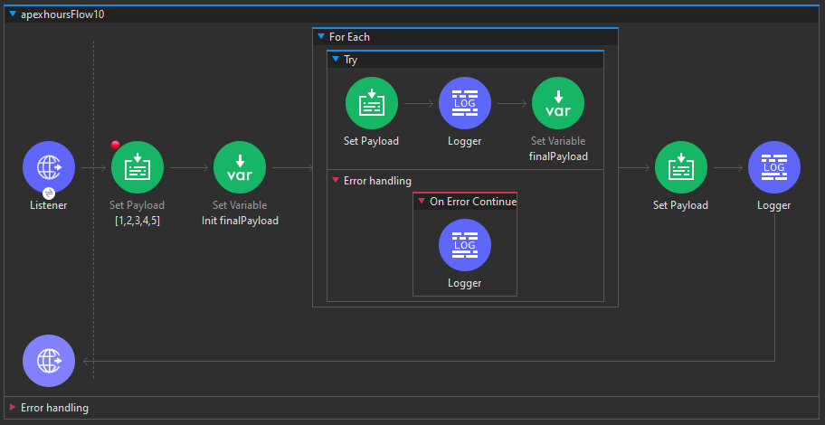

# For - Each en Mule 4

El componente "For-Each" en Mule 4 permite realizar iteraciones sobre una colección de datos, como un array o una lista de objetos. Aquí hay algunos aspectos clave y cosas que debes recordar sobre el "For-Each":

## Configuración Obligatoria

- No se requiere ninguna configuración obligatoria.
- Por defecto, si no se especifica ninguna colección en la pestaña "Collection", toma la carga útil (payload) como colección. El tamaño del lote (batch size) es 1 por defecto.

## Cosas a Recordar sobre For-Each

1. **Colección de Entrada**: La entrada para el "For-Each" debe ser siempre un array o una array de objetos. No se acepta un objeto único.

2. **Valor de la Carga Útil (Payload) Después del Bucle For-Each**: El valor de la carga útil después del bucle "For-Each" es siempre el valor de la carga útil que está presente justo antes del "For-Each".

3. **Iteración como Objetos Individuales**: Dentro del bucle "For-Each", todo se considera como la carga útil de un solo objeto. Aunque la colección sea vars o payload, el valor de la carga útil es siempre un solo objeto dentro del bucle "For-Each".

4. **Detención en Caso de Error**: Si un registro falla en el proceso, entonces el "For-Each" detendrá el procesamiento del resto de los registros. Por ejemplo, si tienes un array de 5 elementos y los dos primeros se procesan correctamente, pero el tercero falla, entonces los registros 4 y 5 no se procesarán.

5. **Manejo de Errores Individuales**: Si deseas procesar todos los registros incluso si hay fallos en registros individuales, debes utilizar un bloque "Try" y usar "On-Error-Continue" para manejar los errores individuales y pasar al siguiente registro.

6. **Configuración de la Colección**: Puedes especificar payload o cualquier valor de variable dentro de la pestaña "Collection", pero definitivamente debe ser un array.

### Ejemplo de Uso:
```xml
<foreach>
    <!-- Configuración de For-Each -->
    <logger level="INFO" message="Processing #[payload]" />
</foreach>
```

En resumen, el componente "For-Each" es esencial para realizar operaciones iterativas en un conjunto de datos, y estas consideraciones ayudan a comprender su comportamiento y cómo gestionar errores durante la iteración.

# Actividad, Parte 1

1. Abre nuestro primer proyecto de `apexhours`

2. Agregamos un nuevo `Listener` con el `Path`: `/foreach`

3. Junto al `Listener` colocamos un `Set Payload` del cuál solo modificaremos su `Display name` por `[1,2,3,4,5]` y colocale un `breakpoint`

4. Seguido de el `Set Payload` colocamos el `For Each`, del cuál por buenas practicas colocamos en `Collection`: `[# payload ]`

5. Dentro del `For Each` colocamos un `Set Payload` y un `Logger`. Del `Set Payload` modificamos su `value` a: `[# payload + 10 ]`. En el caso del `Logger` en el `Message` coloca: `[# "For each inside payload value is ::: " ++ payload ]`

6. Seguido del `For Each` coloca un `Set Payload` y deja todo por default

7. Finalmente coloca al final un `Logger` y en su message solo coloca `[# payload ]`

<div align="center">
    
</div>

8. Guarda y prueba el programa enviando en el cuerpo de la solicitud algo como:
    ```json
    [1,2,3,4,5]
    ```

9. Notaras que la salida es lo mismo que enviamos en la solicitud, para ver mejor en acción el `For Each` usa el modo `debug`, dicho comportamiento ya fue mencionado en la teoría

10. Ahora modificaremos un poco nuestro flujo, agrega un `Set Variable` dentro del `For Each`, justo después del `Logger`

11. Tanto su `display name` como `name` lo dejaremos como: `finalPayload`

12. Necesitamos antes inicializar la variable, para ello colocamos un `Set Variable` justo antes del `For Each` dale el mismo `name` de `finalPayload`

13. Para el código de la variable damos click en _`Fx`_ y agrega: `[# output application/json --- vars.finalPayload + payload ]`

14. Modificamos el `Set Payload` que esta a la derecha del `For Each` en su `Value` colocando: `[# vars.finalPayload ]`

<div align="center">
    
</div>

15. Guarda y prueba el programa

16. Ahora vamos a probar algo, toma un componente `Try` y colocalo dentro del `For Each`, a su vez coloca el `Set Payload`, `Logger` y `Set Variable` dentro de este

17. Luego coloca un `OEC` en el `Try`

18. Dentro del `OEC` coloca un `Logger` y en su `Message` coloca: `[# "Error occured for payload value :: " ++ payload ]`

<div align="center">
    
</div>

19. Guarda todo y prueba el programa en modo `debug` enviando en el cuerpo de la solicitud algo como:
    ```json
    [1,2,"a",4,5]
    ```

20. Ahora haremos uso de un `Parallele For Each`, colocalo justo antes del `For Each`

> [!NOTE]
> Si quieres saber más sobre dicho componente da click [aqui](./Notas_Extras/ConectoresMule.md/#core---parallele-for-each)

21. Dentro del `PFE` coloca todo lo del `Try` y borra el bloque del `For Each`

Si guardamos y probamos nos dara una respuesta extraña, lo dejaremos de momento como algo curioso (ya que en el video del curso no se detalla más al respecto).

# Procesamiento por Lotes (Batch Processing)

El procesamiento por lotes es una característica especial de Mule que nos permite procesar mensajes en lotes dentro de una aplicación. Un trabajo de lote en Mule involucra la división de mensajes en registros individuales, la ejecución de acciones en cada registro y la generación de informes sobre los resultados.

## Alcance del Trabajo de Lote

- **División de Mensajes**: Los mensajes se dividen en registros individuales para su procesamiento.
- **Acciones en Cada Registro**: Se realizan acciones específicas en cada registro dentro del lote.
- **Informes de Resultados**: En la fase de "On-Complete", se genera un informe estadístico que muestra cuántos registros se procesaron, cuántos fueron exitosos y cuántos fallaron.

## Uso Asíncrono y Multihilo

- Diseñado para procesar conjuntos de datos más grandes que la memoria, divididos en registros individuales y ejecutados de manera multihilo.
- La salida en la fase de "On-Complete" proporciona estadísticas detalladas sobre el procesamiento del lote.

## Ejemplo de Configuración
```xml
<batch:job name="sampleBatchJob">
    <batch:process-records>
        <!-- Configuración de Procesamiento por Lotes -->
        <logger level="INFO" message="Processing record #[payload]" />
    </batch:process-records>
    <batch:on-complete>
        <!-- Acciones a realizar en la fase de On-Complete -->
        <logger level="INFO" message="Batch processing completed: #[payload]" />
    </batch:on-complete>
</batch:job>
```

## Resultado en la Fase de On-Complete
- En la fase "On-Complete", se obtiene un informe con estadísticas detalladas del procesamiento del lote, incluyendo el número de registros procesados, exitosos y fallidos.

En resumen, el procesamiento por lotes en Mule 4 es una herramienta poderosa para manejar conjuntos de datos extensos de manera eficiente y asincrónica. Permite la ejecución de acciones en cada registro y proporciona informes detallados en la fase de "On-Complete". Su capacidad multihilo lo convierte en una opción eficaz para tareas que involucran grandes volúmenes de datos.

# Actividad, Parte 2

1. Agregamos un nuevo `Listener` a nuestro canvas con el `Path`: `/batchtest`

2. Seguido del `Listener` agregamos un `Batch Job`

> [!NOTE]
> Si quieres saber más sobre los componentes Batch da click [aqui](./Notas_Extras/ConectoresMule.md/#core---batch-job-batch-aggregator-y-batch-step)

3. Nos aparecerá una oción de `Max Failed Records` dale el valor de 2

4. Notesé que el `Batch Job` tenemos dos secciones `Processors` y `Aggregator`, en la sección de `Processors` agrega un `Set Payload` y dale el `Value` de: `[# payload + 10 ]`

5.  Mientras que en el `Aggregator` coloca un `Batch Aggregator`

6.  En su `Aggregator Size` coloca un 2

7.  Dentro de dicho componente coloca un `Logger` cuyo `Message` será simplemente: `[# payload ]`

8.  Copia y pega dicho `Logger` en la parte de `On Complete`

9.  Coloca un `Breakpoint` en el `Batch Step`

<div align="center">
    
</div>

10. Guardamos y probamos el programa mando una solicitud como lo hicimos _En el paso 8 de la Actividad Parte 1_ y obserba como se comporta, procura que sea en el modo `debug` y revisa también lo que sucede si al `array` de la solicitud le agregas un caracter

11. Ahora modifica el `Message` del `Logger` que esta dentro del `Batch Aggregator` con: `[# write(payload, 'application/json') ]`

12. Guarda y vuelve a probar el programa