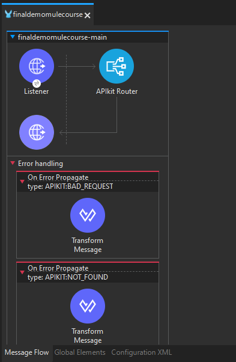

# Despliegue en CloudHub

El despliegue en CloudHub es el proceso de implementar y ejecutar aplicaciones MuleSoft en la plataforma de integración como servicio (iPaaS) de MuleSoft, conocida como CloudHub. Este proceso permite a las organizaciones ejecutar, administrar y escalar fácilmente sus integraciones en la nube sin preocuparse por la infraestructura subyacente.

## Pasos del Proceso de Despliegue:

1. **Creación de la Aplicación:**
   - Antes de desplegar en CloudHub, se debe desarrollar y configurar la aplicación en Anypoint Studio o mediante la creación de archivos de configuración en formato YAML o XML.

2. **Configuración del Proyecto:**
   - En Anypoint Studio, se configuran los parámetros de configuración específicos de CloudHub, como el nombre de la aplicación, el entorno de despliegue, las propiedades de la aplicación, las variables de entorno, etc.

3. **Registro en Anypoint Platform:**
   - La aplicación debe estar registrada en Anypoint Platform, el portal de administración de MuleSoft. Aquí se gestionan los artefactos de la aplicación, se establecen las políticas de seguridad y se configuran las métricas de rendimiento.

4. **Empaquetado y Despliegue:**
   - Una vez que la aplicación está lista y configurada, se empaqueta en un archivo JAR o ZIP, que luego se carga en CloudHub a través de la consola de administración de Anypoint Platform.
   - Durante el despliegue, se pueden especificar configuraciones adicionales, como la cantidad de instancias, el tamaño de la instancia, las variables de entorno específicas de CloudHub, etc.

5. **Monitoreo y Administración:**
   - Después del despliegue, la aplicación se ejecuta en el entorno de CloudHub. Desde la consola de administración de Anypoint Platform, se pueden monitorear y administrar métricas de rendimiento, registros de aplicaciones, escalado automático, etc.

## Beneficios del Despliegue en CloudHub:

- **Escalabilidad:** CloudHub proporciona escalabilidad automática para manejar cargas de trabajo variables y picos de tráfico sin interrupciones en el servicio.
- **Alta Disponibilidad:** La infraestructura de CloudHub está altamente disponible, con redundancia incorporada y capacidades de conmutación por error para garantizar la continuidad del servicio.
- **Gestión Simplificada:** La gestión de la infraestructura subyacente, la configuración de red, la seguridad y las actualizaciones del sistema están completamente gestionadas por MuleSoft, lo que libera a los equipos de TI de tareas operativas.
- **Rápida Implementación:** El despliegue en CloudHub es rápido y sencillo, lo que permite a las organizaciones poner en funcionamiento sus integraciones en la nube en cuestión de minutos.

## Consideraciones de Seguridad:

- Es importante implementar prácticas de seguridad sólidas, como el cifrado de datos en reposo y en tránsito, la autenticación de usuarios y la autorización basada en roles, para proteger los datos y las aplicaciones desplegadas en CloudHub.

# Actividad, Parte 1

1. Vamos al `Design Center` de `Anypoint`

2. Cremaos una nueva `API Specification` de nombre `FinalDemoMuleCourse`

3.  Luego creamos una API sencilla en `RAML`:
    ```yaml
    #%RAML 1.0
    title: FinalDemoMuleCourse

    /getOrderDetails:
        get:
            responses:
                200:
                    body:
                        application/json:
                            example:
                                {
                                    "order": 1,
                                    "status": "open"
                                }

    /postOrderDetails:
        post:
            responses:
                200:
                    body:
                        application/json:
                            example:
                                {
                                    "order": 1,
                                    "status": "created"
                                }
        put:
            responses:
                200:
                    body:
                        application/json:
                            example:
                                {
                                    "order": 1,
                                    "status": "updated"
                                }
    ```

4. Ahora publicaremos la API, asi que da click en `Publish` -> `Publish to Exchange`

5. Crearemos un nuevo proyecto en nuestro `Anypoint Studio`, dandole el mismo nombre que le dimos a nuestra API de RAML, pero antes de dar click en crear, obsevemos que hay una opción de nombre `Import a published API` y debajo de esta un icono de `+`, da click ahí, luego en `from Exchange` -> `Add Account`. Inicia sesión con tu cuenta de `Anypoint`. Agregada la cuenta si no aparecen las opciones escribe en el input de busqueda el nombre de nuestra API, una vez aparezca seleccionala y da click en `Add` -> `Finish`. Una vez termine de cargar ahora si damos click en el `Finish` para que se cree el proyecto

6. Notese que se nos crearon de forma automatica el flujo de nuestra API

<div align="center">
    
</div>

> [!WARNING]
> Debido a que algunas funciones de Anypoint son solo de prueba de 30 días y ya excedimos dicho tiempo se recomienda la creación de una nueva cuenta y seguir los paso del [video](https://www.youtube.com/watch?v=yrip-zI7f3A&list=PL61bQcdxsK6_f5GDV3f2STtMTS3nYIlYO&index=20) a partir del minuto 14