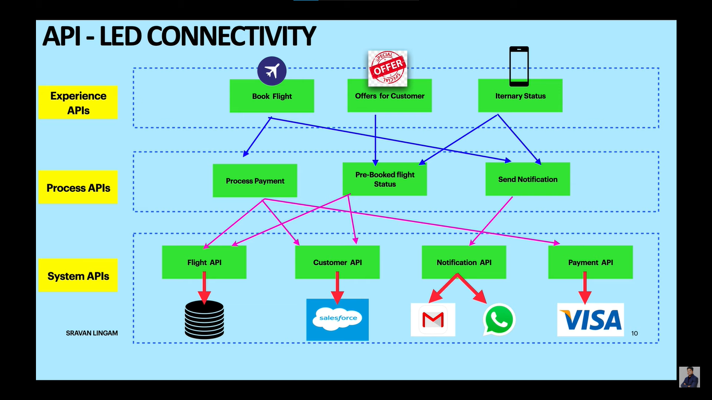

# ¿Que es MuleSoft?

MuleSoft es una plataforma de software que permite la integración y la automatización de datos, sistemas y procesos entre diferentes aplicaciones y dispositivos. MuleSoft fue adquirida por _`Salesforce`_ en 2018 y forma parte de su ecosistema de soluciones.

MuleSoft se usa para conectar todo tipo de fuentes de datos, ya sean internas o externas, en la nube o en las instalaciones, mediante el uso de `APIs` y flujos de trabajo. MuleSoft facilita la creación, el despliegue y la gestión de `APIs`, así como la reutilización de componentes y activos digitales.

Algunas de las ventajas de usar MuleSoft son:

- Aumenta la agilidad y la velocidad de desarrollo y entrega de proyectos, al reducir la complejidad y el código necesario para integrar sistemas.
- Mejora la eficiencia y la productividad de los equipos de TI, al liberarlos de tareas rutinarias y permitirles enfocarse en la innovación y el valor añadido.
- Ofrece una experiencia conectada y personalizada a los clientes, al acceder a datos en tiempo real y ofrecer servicios integrados y omnicanal.
- Optimiza los procesos empresariales, al automatizar flujos de trabajo complejos y eliminar cuellos de botella e inconsistencias.
- Aprovecha el potencial de los datos, al facilitar el análisis, la inteligencia artificial y el aprendizaje automático.

MuleSoft es una plataforma líder en el mercado de la integración y la automatización, que ofrece soluciones flexibles, escalables y seguras para todo tipo de organizaciones y sectores.

# Anypoint

MuleSoft ofrece una plataforma de integración y gestión de API llamada `Anypoint`. Anypoint es una solución que permite conectar, diseñar, implementar y gestionar APIs de forma fácil y segura. Con Anypoint, se puede crear una red de aplicaciones que intercambian datos y funcionalidades, aprovechando las ventajas de la arquitectura orientada a servicios (SOA) y la computación en la nube.

Una de las características más destacadas de Anypoint es el `API Managment Platform`, que es un conjunto de herramientas y servicios para administrar el ciclo de vida de las APIs, desde su creación hasta su consumo. El API Managment Platform incluye:

- **Anypoint Design Center:** Un entorno de desarrollo integrado (IDE) que facilita el diseño y la documentación de las APIs, usando estándares como RAML y OpenAPI.

- **Anypoint Exchange:** Un repositorio centralizado donde se pueden publicar y descubrir las APIs disponibles, así como otros recursos como conectores, plantillas y ejemplos.

- **Anypoint Studio:** Un IDE basado en Eclipse que permite implementar las APIs usando el framework Mule, que es un motor de integración ligero y flexible.

- **Anypoint Runtime Manager:** Una consola web que permite desplegar, monitorizar y gestionar las APIs en diferentes entornos, ya sean locales, en la nube o híbridos.

- **Anypoint API Manager:** Un servicio que permite aplicar políticas de seguridad, control de acceso, limitación de tráfico y análisis de rendimiento a las APIs, así como generar informes y alertas.

- **Anypoint Visualizer:** Una herramienta que permite visualizar la topología y las dependencias de las APIs y las aplicaciones que las consumen, facilitando la detección y resolución de problemas.

- **Anypoint Monitoring:** Una solución que proporciona información en tiempo real sobre el estado y el comportamiento de las APIs y las aplicaciones, incluyendo métricas, trazas, registros y paneles personalizados.

Anypoint es una plataforma que ofrece una experiencia unificada para el desarrollo y la gestión de APIs, permitiendo a las organizaciones acelerar su transformación digital y ofrecer experiencias innovadoras a sus clientes, socios y empleados.

# API Led Connectivity

API Led Connectivity es un enfoque para conectar y exponer activos digitales mediante el uso de APIs. Este enfoque permite una mayor agilidad, reutilización y gobernabilidad de los datos y servicios que se ofrecen a los consumidores internos y externos. En el contexto de MuleSoft, API Led Connectivity se basa en la plataforma Anypoint, que facilita el diseño, la implementación, la gestión y el consumo de APIs de forma integrada y segura. A continuación se describen los principales componentes y beneficios de API Led Connectivity tanto en el ámbito de MuleSoft como de manera general.

Componentes de API Led Connectivity

- **APIs de experiencia:** Son las APIs que se adaptan a las necesidades específicas de cada canal o consumidor, ya sea una aplicación web, móvil, un partner o un dispositivo IoT. Estas APIs se encargan de orquestar y transformar los datos que provienen de las APIs de proceso y de sistema, ofreciendo una experiencia personalizada y optimizada para cada caso de uso.
- **APIs de proceso:** Son las APIs que implementan la lógica de negocio y los flujos de trabajo que involucran a varios sistemas o servicios. Estas APIs se encargan de coordinar y mediar entre las APIs de sistema y las APIs de experiencia, agregando valor y funcionalidad a los datos que se intercambian.
- **APIs de sistema:** Son las APIs que se conectan directamente con los sistemas de origen, como bases de datos, aplicaciones legacy, sistemas ERP o CRM, etc. Estas APIs se encargan de abstraer y normalizar la forma de acceder y manipular los datos que residen en estos sistemas, ofreciendo una interfaz estandarizada y homogénea para su consumo.

Beneficios de API Led Connectivity

- **Agilidad:** Al utilizar APIs como bloques modulares y reutilizables, se reduce el tiempo y el esfuerzo necesario para desarrollar e integrar nuevas soluciones digitales, permitiendo responder más rápido a los cambios del mercado y a las demandas de los clientes.
- **Reutilización:** Al exponer los activos digitales mediante APIs, se facilita su descubrimiento y consumo por parte de otros desarrolladores o equipos, evitando la duplicación de esfuerzos y la creación de silos de información.
- **Gobernabilidad:** Al gestionar las APIs mediante una plataforma como Anypoint, se puede controlar el ciclo de vida, la seguridad, el rendimiento, la monitorización y la analítica de las mismas, asegurando su calidad, disponibilidad y cumplimiento normativo.

## System APIs

Las System APIs son un tipo de API que se encargan de exponer los datos y funcionalidades de los sistemas subyacentes, como bases de datos, aplicaciones legacy, sistemas ERP, etc. Estas APIs actúan como una capa de abstracción que oculta la complejidad y heterogeneidad de los sistemas, y facilita su integración con otras capas de la arquitectura API-led.

En el contexto de MuleSoft, las System APIs se desarrollan utilizando el framework de Anypoint Platform, que ofrece herramientas para diseñar, implementar, documentar, gestionar y consumir las APIs. Además, MuleSoft proporciona conectores predefinidos para facilitar la conexión con los sistemas más comunes, como Salesforce, SAP, Oracle, etc. Así mismo, se pueden crear conectores personalizados para adaptarse a las necesidades específicas de cada sistema.

Las System APIs son la base de la arquitectura API-led, ya que permiten crear una capa de acceso estandarizada y reutilizable a los activos del negocio. De esta forma, se evita el acoplamiento directo entre los consumidores y los sistemas, y se mejora la agilidad, la seguridad y la escalabilidad de las integraciones.

## Process APIs

Las Process APIs son un tipo de API que se encargan de orquestar los procesos de negocio de una organización, integrando los datos y las funcionalidades de las System APIs y las Experience APIs. Las Process APIs permiten abstraer la lógica de negocio de los sistemas subyacentes y ofrecer una capa de servicio que puede ser consumida por diferentes canales y aplicaciones.

En el contexto de MuleSoft, las Process APIs se diseñan y construyen utilizando la plataforma Anypoint, que facilita el desarrollo, la gestión y la gobernabilidad de las APIs. Con Anypoint Platform, se puede aplicar el enfoque de API-led connectivity, que consiste en crear una red de APIs modulares y reutilizables que se alinean con las necesidades del negocio. Las Process APIs forman parte de esta red, junto con las System APIs y las Experience APIs, y se comunican entre sí mediante el intercambio de mensajes estandarizados.

## Experience APIs

Las Experience APIs son un tipo de API que se enfocan en ofrecer una experiencia personalizada y adaptada a las necesidades de los consumidores. Estas APIs se encargan de orquestar y transformar los datos y servicios provenientes de otras APIs, como las System APIs o las Process APIs, para crear una capa de presentación que facilite el consumo de la información.

En el contexto de MuleSoft, las Experience APIs son una parte fundamental de la metodología API-led Connectivity, que propone una arquitectura basada en tres capas de APIs: System, Process y Experience. Cada capa tiene una función específica y se comunica con las demás mediante contratos bien definidos. De esta forma, se logra una mayor agilidad, reusabilidad y escalabilidad en el desarrollo y gestión de las APIs.

Las Experience APIs permiten a los desarrolladores crear interfaces de usuario, aplicaciones móviles o portales web que consuman los datos y servicios expuestos por las otras capas de APIs. Así, se puede ofrecer una experiencia óptima para cada tipo de consumidor, ya sea interno o externo, sin afectar la lógica o el rendimiento de las APIs subyacentes. Además, las Experience APIs facilitan la integración con otras plataformas o sistemas, como Salesforce, Workday o SAP, mediante el uso de conectores predefinidos o personalizados.

## Ejemplo de todo lo antes explicado

    
    <h6>Figura 1</h6>

La `figura 1` muestra un diagrama de conectividad liderado por API (Interfaz de Programación de Aplicaciones). Se divide en tres niveles: APIs de experiencia, APIs de proceso y APIs del sistema. 

- **APIs de Experiencia**: Estas son las interfaces que interactúan directamente con los usuarios finales. En el diagrama, se muestran tres acciones específicas: "_Book Flight_", "_Offers for Customer_" e "_Itinerary Status_". Estas acciones están diseñadas para proporcionar una experiencia directa y eficiente al cliente.

- **APIs de Proceso**: Actúan como intermediarios que procesan las solicitudes entre las APIs de experiencia y del sistema. En este caso, gestionan el pago, verifican el estado del vuelo pre-reservado y envían notificaciones.

- **APIs del Sistema**: Son la base que se conecta con bases de datos o sistemas externos para recuperar o enviar datos necesarios. Aquí se incluyen la API del vuelo, la API del cliente, la API de notificación y la API de pago.

El flujo comienza con una acción iniciada por el usuario final a través de las APIs de experiencia (por ejemplo, reservar un vuelo). Luego, esta solicitud es procesada por las APIs correspondientes en el nivel intermedio (proceso), como procesar el pago o verificar el estado del vuelo pre-reservado. Finalmente, estas solicitudes son manejadas y ejecutadas por las APIs del sistema que están integradas con bases específicas o sistemas externos. 

En resumen, este diagrama muestra cómo las diferentes APIs trabajan juntas para proporcionar una experiencia fluida y eficiente al usuario final.

### Reutilizar, dividir y segregar

En el diagrama de la `figura 1` de conectividad liderado por API, los conceptos de reutilizar, dividir y segregar la API se aplican de la siguiente manera:

- **Reutilización**: Las APIs de sistema, como la API del vuelo, la API del cliente, la API de notificación y la API de pago, se pueden reutilizar en diferentes procesos. Por ejemplo, la API de notificación puede ser utilizada tanto para notificar el estado del itinerario como para confirmar el pago.

- **División**: El diagrama divide las APIs en tres niveles: APIs de experiencia, APIs de proceso y APIs del sistema. Esta división permite que cada nivel se enfoque en una tarea específica, lo que facilita la gestión y el mantenimiento del sistema.

- **Segregación**: Cada API se encarga de una tarea específica y está segregada de las demás. Por ejemplo, la API de pago se encarga únicamente de procesar los pagos, mientras que la API de notificación se encarga de enviar notificaciones.

En cuanto a los escenarios de fallo, como la caída de la API de notificaciones, el diseño de este sistema permite manejar tales situaciones de manera eficiente. Si la API de notificaciones falla, no afectará directamente a las otras APIs. Por ejemplo, la reserva de vuelos y el procesamiento de pagos pueden continuar funcionando sin problemas. Además, se pueden implementar mecanismos de recuperación y alerta para manejar estos fallos, como intentar enviar la notificación de nuevo después de un cierto período de tiempo o alertar al equipo de soporte técnico para que solucione el problema. Esto es un ejemplo de cómo la segregación de las APIs contribuye a la robustez del sistema.