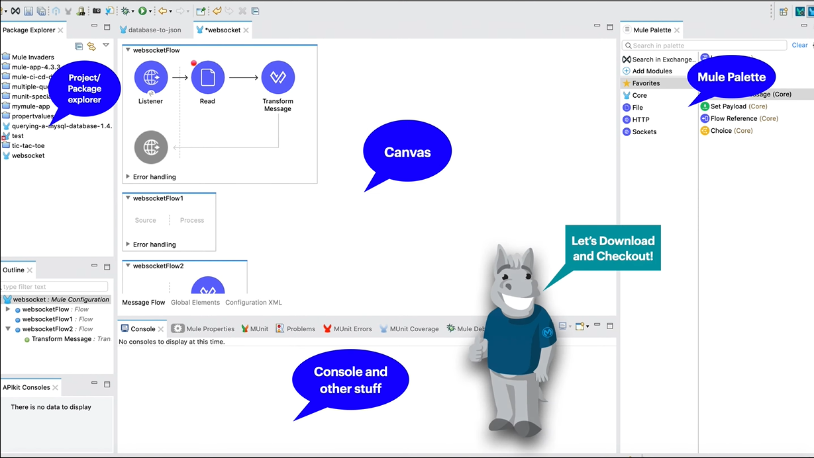

# Mule 4 - Estructura del Mule Event

Mule 4, la última iteración del motor de integración de MuleSoft, introduce el concepto fundamental del Mule Event, que encapsula y organiza la información clave en el proceso de integración. El Mule Event consta de tres elementos esenciales: el Mule Message (Mensaje Mule), las variables y la información de error.

## 1. **Mule Message (Mensaje Mule):**
   - En el corazón del Mule Event se encuentra el Mule Message, que representa la entidad principal que fluye a lo largo del proceso de integración. Este mensaje Mule consiste en dos componentes fundamentales:

     - **Carga Útil (Payload):** Contiene los datos que se transmiten o procesan durante la integración. Puede adoptar diversos formatos, desde texto simple hasta objetos complejos, y se presta a transformaciones y manipulaciones mediante los componentes y conectores de Mule 4.

       **Ejemplo:**
       ```json
       {
         "user": "John Doe",
         "age": 30,
         "city": "Example City"
       }
       ```

     - **Atributos (Attributes):** Son metadatos asociados al mensaje que proporcionan información adicional sobre su origen, destino o tipo. Estos atributos se generan automáticamente al entrar o salir de conectores y contienen detalles cruciales como la dirección IP, el nombre del archivo, el formato del contenido o los parámetros de la petición HTTP.

       **Ejemplo:**
       ```json
       Attributes:
       {
         "source": "HTTP",
         "destination": "Application",
         "contentType": "application/json",
         "timestamp": "2023-01-01T12:00:00"
       }
       ```

## 2. **Variables:**
   - Las variables en el Mule Event permiten almacenar y recuperar valores de manera eficiente dentro del mismo flujo de Mule 4. Estas variables son esenciales para retener información temporal o intermedia que se requiere para la lógica del flujo. Pueden crearse, modificarse o eliminarse mediante componentes como Set Variable, Remove Variable y Transform Message. Su alcance está limitado al flujo en el que se definen.

   **Ejemplo:**
   ```mule
   <set-variable variableName="customerId" value="#[payload.customerId]" />
   ```

## 3. **Información de Error:**
   - El Mule Event también incorpora información de error, crucial para la detección y manejo de errores en el flujo de integración. Esta información incluye detalles sobre excepciones y permite tomar decisiones informadas sobre cómo gestionar situaciones inesperadas.

   **Ejemplo (Manejo de Excepciones):**
   ```mule
   <error-handler>
     <on-error-propagate type="CUSTOM:INVALID_DATA">
       <!-- Lógica para manejar la excepción -->
     </on-error-propagate>
   </error-handler>
   ```

## Estructura del Mule Event en Mule 4:
   ```
   +---------------------+
   |     Mule Message    |
   | - Payload           |
   | - Attributes        |
   +---------------------+
   |      Variables      |
   +---------------------+
   | Información de Error|
   +---------------------+
   ```

El Mule Event se erige como la estructura principal que unifica y organiza estos componentes clave, proporcionando un enfoque integral y eficiente para el procesamiento de integraciones en Mule 4.

> [!IMPORTANT]
> Para este punto deberemos descargar el Anypoint Studio y el Java 8 para poder continuar con las actividades a realizar.

# Actividad, Parte 1

1. Abrimos `Anypoint Studio` y creamos un nuevo `Mule Project`

2. Le daremos el nombre de `ApexHours` y simplemente creamos el proyecto sin mayores configuraciones.

# Estructura de un Proyecto en Mule 4

<div align="center">
   
</div>

La organización de un proyecto en Mule 4 sigue una estructura bien definida, que abarca diversos elementos esenciales para su desarrollo, prueba y despliegue. A continuación, se detallan los componentes fundamentales de la estructura de un proyecto en Mule 4:

## 1. **Archivo pom.xml:**
   - Este archivo define las dependencias y plugins del proyecto. Utiliza el formato Maven y es esencial para gestionar las bibliotecas y configuraciones necesarias durante el ciclo de vida del proyecto.

   **Ejemplo:**
   ```xml
   <!-- Contenido básico de un archivo pom.xml -->
   <project>
     <dependencies>
       <!-- Dependencias del proyecto -->
     </dependencies>
     <build>
       <!-- Configuración de plugins y fases de construcción -->
     </build>
   </project>
   ```

## 2. **Carpeta src/main/mule:**
   - Contiene los archivos de configuración de los flujos de Mule. Estos archivos pueden estar en formato XML o DSL (Domain Specific Language) según la preferencia del desarrollador.

   **Ejemplo:**
   ```xml
   <!-- Ejemplo de un archivo de configuración en XML -->
   <mule>
     <flow name="exampleFlow">
       <!-- Configuración del flujo -->
     </flow>
   </mule>
   ```

## 3. **Carpeta src/main/resources:**
   - Almacena recursos externos al proyecto, como propiedades, esquemas, certificados, etc. Estos recursos son fundamentales para la configuración y operación adecuada de la aplicación.

   **Ejemplo:**
   ```css
   src/main/resources/
   ├── properties/
   │   └── config.properties
   ├── schemas/
   │   └── example.xsd
   └── certificates/
       └── myCertificate.pem
   ```

## 4. **Carpeta src/test/munit:**
   - Contiene archivos de pruebas unitarias e integración utilizando MUnit, el framework de testing de MuleSoft. Estas pruebas aseguran la calidad y confiabilidad del código.

   **Ejemplo:**
   ```xml
   <!-- Ejemplo de un archivo de prueba MUnit -->
   <munit>
     <!-- Configuración de la prueba -->
   </munit>
   ```

## 5. **Carpeta src/test/resources:**
   - Guarda los recursos necesarios para las pruebas, como datos de entrada, mocks, etc. Estos recursos respaldan las pruebas unitarias e integración definidas en la carpeta src/test/munit.

   **Ejemplo:**
   ```css
   src/test/resources/
   ├── input-data/
   │   └── test-input.json
   ├── mocks/
   │   └── example-mock.xml
   └── configurations/
       └── test-config.xml
   ```

## 6. **Archivo mule-artifact.json:**
   - Este archivo es parte integral de la estructura de un proyecto en Mule 4 y contiene información específica sobre el artefacto Mule, incluyendo detalles sobre la versión de Mule, las configuraciones del dominio, las dependencias y otros aspectos cruciales.

   **Ejemplo:**
   ```json
   {
     "name": "mule-project",
     "minMuleVersion": "4.5.0",
     "requiredProduct": "mule",
     "version": "1.0.0",
     "classLoaderModel": "mule",
     "exportedPackages": ["org.example"],
     "exportedResources": ["**/*.xml"],
     "configurations": {
       "domain": "default"
     },
     "deployedServices": [],
     "dependencyCoordinates": [
       {
         "groupId": "org.example",
         "artifactId": "dependency",
         "version": "1.0.0",
         "classifier": "mule-plugin",
         "type": "zip"
       }
     ],
     "bundleDescriptor": {
       "groupId": "org.example",
       "artifactId": "mule-project",
       "version": "1.0.0",
       "classifier": "mule-application"
     }
   }
   ```

Este archivo, en formato JSON, proporciona detalles cruciales para la construcción, empaquetado y despliegue del proyecto en Mule 4. Contiene información sobre la versión mínima de Mule requerida, configuraciones de dominio, paquetes y recursos exportados, dependencias y más. La inclusión de este archivo refuerza la estructura del proyecto y facilita su gestión y despliegue coherentes.

## Message Flow (Flujo de Mensajes):

En un proyecto de Mule 4, el concepto de "Message Flow" o Flujo de Mensajes representa la secuencia de pasos y procesos a través de los cuales un mensaje viaja durante su procesamiento. Este flujo define cómo se manipula la carga útil (payload), se interactúa con variables y atributos, y se aplican transformaciones y lógica de negocio.

Dentro del Message Flow, los componentes como "Message Sources" (Fuentes de Mensajes), "Processors" (Procesadores), y "Connectors" (Conectores) son configurados para realizar acciones específicas. El Message Flow es esencial para entender cómo se manejan los datos desde la entrada hasta la salida, y cómo se aplican las transformaciones y lógica del negocio en el proceso de integración.

## Global Elements (Elementos Globales):

Los "Global Elements" o Elementos Globales en un proyecto de Mule 4 son configuraciones reutilizables y compartidas en diferentes partes del proyecto. Estos elementos abarcan configuraciones de conectores, propiedades de seguridad, y otros parámetros que deben ser consistentes en todo el proyecto.

Al centralizar estas configuraciones en Elementos Globales, se facilita el mantenimiento y la coherencia del proyecto. Por ejemplo, un Elemento Global podría contener la configuración de un conector a una base de datos, y este elemento podría ser referenciado en varios lugares del Message Flow, evitando duplicidad de configuraciones y simplificando la gestión.

## Configuration XML (Archivo de Configuración XML):

El archivo de configuración XML en la carpeta `src/main/mule` es esencial para definir la estructura del proyecto y sus componentes. En este archivo, se especifican las configuraciones generales del proyecto, como las dependencias, propiedades, y la configuración del dominio. Además, puede contener la definición de flujos, subflujos, y otros componentes.

Este archivo XML actúa como el punto de entrada para la configuración del proyecto y es interpretado por Mule 4 para construir el contexto de ejecución. Permite una visión integral de la estructura del proyecto y es donde se definen los flujos de mensajes, elementos globales y otras configuraciones cruciales.

## Creación y Ejecución del Proyecto:
   - Un proyecto de Mule 4 puede crearse desde Anypoint Studio o mediante la línea de comandos con Maven. La ejecución y gestión se realiza con Anypoint Runtime Manager, permitiendo desplegar y administrar aplicaciones en entornos locales, en la nube o híbridos.

Esta estructura proporciona una base sólida para el desarrollo, prueba y despliegue efectivos de aplicaciones en Mule 4, facilitando la gestión de dependencias, la configuración de flujos y la realización de pruebas con MUnit.

# Flujos en Mule 4: Flow, Sub-Flow y Private Flow

En Mule 4, los flujos son la esencia del procesamiento, ofreciendo una estructura modular para organizar y ejecutar la lógica de integración. El "Flow" se destaca como la unidad básica, comprendiendo una secuencia de componentes que manipulan mensajes desde la entrada hasta la salida. En este contexto, exploraremos tres variantes clave: el "Sub-Flow," diseñado para la reutilización eficiente de lógica común, y el "Private Flow," una herramienta poderosa para la ejecución asíncrona y delegación de tareas secundarias. A medida que profundizamos en cada uno, entenderemos cómo estos elementos contribuyen a la flexibilidad y eficacia en el diseño de integraciones en Mule 4.

## Flow

El "Flow" es la unidad fundamental de procesamiento que organiza la lógica de integración. Un flow se compone de una secuencia de componentes interconectados diseñados para recibir, transformar y enviar mensajes de manera eficiente. Estos flujos desempeñan un papel clave en la construcción de aplicaciones Mule, permitiendo la orquestación de operaciones complejas de manera modular y estructurada.

**Puntos de Entrada (Sources):**
Cada flow puede tener uno o más puntos de entrada, conocidos como "sources", que definen cómo y cuándo se inicia el flujo. Los sources pueden variar desde listeners HTTP que esperan peticiones web hasta programadores (schedulers) que activan el flujo periódicamente. Estos puntos de entrada son vitales para determinar el disparador o la condición que inicia la ejecución del flow.

**Puntos de Salida (Sinks):**
De manera complementaria, los flujos también cuentan con uno o más puntos de salida, conocidos como "sinks", que especifican cómo y dónde se envían los mensajes al final del flujo. Los sinks pueden ser desde requesters HTTP que realizan llamadas a servicios web externos hasta loggers que registran información en el sistema de registros. Estos puntos de salida definen el destino o las acciones que se toman al completar el procesamiento del flujo.

**Estructura y Componentes:**
En la estructura de un flow, los componentes desempeñan roles específicos, como transformar datos, aplicar lógica de negocio o interactuar con sistemas externos a través de conectores. La configuración de un flow se realiza mediante archivos de configuración Mule, ya sea en formato XML o DSL (Domain Specific Language), lo que permite la descripción detallada de la secuencia de operaciones.

**Ejemplo Básico:**
```xml
<mule>
  <flow name="ejemploFlow">
    <http:listener config-ref="HTTP_Listener_Configuration" path="/api/endpoint" doc:name="HTTP"/>
    <logger message="Mensaje recibido: #[payload]" level="INFO" doc:name="Logger"/>
  </flow>
</mule>
```

En este ejemplo simple, el flow "ejemploFlow" se inicia con un listener HTTP y utiliza un logger para registrar el mensaje recibido. Este es un caso básico, pero los flujos pueden involucrar operaciones más complejas según los requisitos de integración.

### Detalles Adicionales

El "Flow" en Mule 4, además de su estructura básica, incorpora dos componentes fundamentales que enriquecen su funcionalidad: "Process" y "Manejo de Errores". Estos elementos amplían la capacidad del flujo para ejecutar lógica específica y gestionar situaciones inesperadas de manera efectiva.

**Proceso (Process):**
Dentro de un flujo, el componente "Process" proporciona un espacio dedicado para la ejecución de lógica de negocio y transformaciones de datos. Este componente actúa como un contenedor flexible donde se pueden agregar múltiples operaciones para manipular la carga útil del mensaje, interactuar con variables o realizar cualquier acción necesaria durante el procesamiento.

## Ejemplo de Uso de Process:
```xml
<flow name="ejemploProceso">
  <http:listener config-ref="HTTP_Listener_Configuration" path="/api/endpoint" doc:name="HTTP"/>
  <processor-chain>
    <!-- Operaciones de procesamiento -->
    <logger message="Mensaje antes de la transformación: #[payload]" level="INFO" doc:name="Logger1"/>
    <set-payload value="#[payload.toUpperCase()]" doc:name="Transformación de Mayúsculas"/>
    <logger message="Mensaje después de la transformación: #[payload]" level="INFO" doc:name="Logger2"/>
  </processor-chain>
</flow>
```
En este ejemplo, el "Process" utiliza una cadena de procesadores para realizar una transformación simple de mayúsculas en el mensaje recibido.

## Manejo de Errores (Error Handling):

Mule 4 proporciona capacidades robustas para manejar errores en un flujo a través de componentes dedicados al "Manejo de Errores". Estos componentes permiten definir acciones específicas que deben tomarse cuando se produce una excepción durante la ejecución del flujo. El manejo de errores es esencial para garantizar la integridad y disponibilidad de la aplicación, así como para proporcionar información significativa sobre problemas potenciales.

## Ejemplo de Configuración de Manejo de Errores:
```xml
<flow name="ejemploManejoErrores">
  <http:listener config-ref="HTTP_Listener_Configuration" path="/api/endpoint" doc:name="HTTP"/>
  <!-- Configuración de manejo de errores -->
  <error-handler>
    <on-error-propagate type="CUSTOM:INVALID_DATA">
      <logger message="Error de datos no válido: #[error.description]" level="ERROR" doc:name="LoggerError"/>
    </on-error-propagate>
  </error-handler>
</flow>
```
En este ejemplo, el componente "Manejo de Errores" está configurado para propagar una excepción de tipo "CUSTOM:INVALID_DATA" y registra detalles del error en el sistema de registros.

La incorporación de "Process" y "Manejo de Errores" en un flujo enriquece la capacidad del desarrollador para implementar lógica específica y gestionar situaciones inesperadas de manera proactiva, mejorando así la confiabilidad y mantenibilidad de la aplicación.

## Private Flow

El "Private Flow" comparte muchas similitudes con el "Flow" convencional, pero se destaca por su ejecución asíncrona e independiente. Aunque comparte la estructura básica y componentes clave con el "Flow" estándar, las diferencias fundamentales radican en su capacidad para delegar tareas secundarias a un hilo de ejecución separado.

## Similitudes con Flow:

Al igual que el "Flow," el "Private Flow" tiene puntos de entrada (sources) y una estructura que consta de componentes interconectados, permitiendo la manipulación y procesamiento de mensajes. Los componentes utilizados en la estructura de un "Private Flow" son los mismos que se emplean en un "Flow" convencional.

## Diferencias Clave:

- **Sources sin Sinks:**
  - A diferencia de un "Flow" normal, un "Private Flow" tiene sources, pero no tiene sinks. Esto significa que un "Private Flow" se inicia desde un punto específico, pero no tiene un punto de salida definido dentro del mismo flujo.

- **Ejecución Asíncrona:**
  - La ejecución de un "Private Flow" es asíncrona e independiente del flujo o sub-flujo que lo inicia. Esto permite que el hilo principal continúe con su procesamiento principal sin esperar la finalización del "Private Flow."

## Ejemplo de Uso de Private Flow:
```xml
<flow name="flujoPrincipal">
  <http:listener config-ref="HTTP_Listener_Configuration" path="/api/principal" doc:name="HTTP"/>
  <!-- Inicia el Private Flow de forma asíncrona -->
  <async doc:name="Async">
    <private-flow name="privateFlow"/>
  </async>
</flow>

<private-flow name="privateFlow">
  <!-- Estructura y componentes del Private Flow -->
  <logger message="Procesando en el Private Flow" level="INFO" doc:name="Logger"/>
</private-flow>
```

En este ejemplo, el "Private Flow" es invocado de manera asíncrona desde el "flujoPrincipal," permitiendo que el flujo principal continúe su ejecución sin esperar la finalización del "Private Flow."

El "Private Flow" en Mule 4 ofrece una forma eficaz de delegar tareas secundarias a un hilo de ejecución independiente, mejorando la eficiencia y el rendimiento general de la aplicación.

## Sub-Flow

El "Sub-Flow" es una construcción especial que comparte similitudes con el "Flow" estándar, pero se diferencia por su propósito principal de reutilización. Diseñado para encapsular lógica común y evitar la duplicación de código, el "Sub-Flow" se invoca desde otros flujos o sub-flujos mediante el componente `flow-ref`.

## Similitudes con Flow:

- Al igual que el "Flow," el "Sub-Flow" posee una estructura compuesta por componentes interconectados que manipulan y procesan mensajes.
- Puede contener sources y sinks, lo que significa que puede tener puntos de entrada y salida, aunque su invocación típicamente se realiza mediante el componente `flow-ref`.

## Diferencias Clave:

- **Reutilización de Lógica:**
  - La principal diferencia radica en su propósito de reutilización. Los "Sub-Flows" se diseñan para encapsular lógica común que puede ser utilizada en varios lugares, promoviendo la modularidad y reduciendo la duplicación de código.

**Ejemplo de Uso de Sub-Flow:**
```xml
<flow name="flujoPrincipal">
  <http:listener config-ref="HTTP_Listener_Configuration" path="/api/principal" doc:name="HTTP"/>
  <!-- Invoca el Sub-Flow -->
  <flow-ref name="subFlujo" doc:name="ReferenciaFlujo"/>
</flow>

<sub-flow name="subFlujo">
  <!-- Estructura y componentes del Sub-Flow -->
  <logger message="Ejecutando lógica común en el Sub-Flow" level="INFO" doc:name="Logger"/>
</sub-flow>
```

En este ejemplo, el "Sub-Flow" se invoca desde el "flujoPrincipal" mediante `flow-ref`, permitiendo la ejecución de la lógica encapsulada en el "Sub-Flow."

**Manejo de Errores en Sub-Flows:**
- Mule 4 facilita el manejo de errores en los "Sub-Flows." Puedes utilizar componentes de manejo de errores dentro del "Sub-Flow" para definir cómo se gestionan las excepciones específicas dentro de ese contexto.

**Ejemplo de Configuración de Manejo de Errores en Sub-Flow:**
```xml
<sub-flow name="subFlujo">
  <!-- Estructura y componentes del Sub-Flow -->
  <error-handler>
    <on-error-propagate type="CUSTOM:INVALID_DATA">
      <logger message="Error de datos no válido en el Sub-Flow: #[error.description]" level="ERROR" doc:name="LoggerError"/>
    </on-error-propagate>
  </error-handler>
</sub-flow>
```

En este ejemplo, el "Sub-Flow" tiene una configuración de manejo de errores específica para el tipo de excepción "CUSTOM:INVALID_DATA," permitiendo un control más granular sobre cómo se gestionan los errores en ese contexto.

El "Sub-Flow" en Mule 4 proporciona una herramienta poderosa para la reutilización de lógica y permite un manejo flexible de errores dentro de su propio contexto.

# Conectores (Connectors)

<div align="center">
   
</div>

Los "Connectors" en Mule 4 son elementos fundamentales que permiten la conexión y la interacción con sistemas externos, servicios web, bases de datos y otras aplicaciones. Estos componentes proporcionan una interfaz estandarizada para integrar Mule con una amplia variedad de tecnologías y recursos. Cada conector está diseñado específicamente para un tipo de sistema o protocolo, facilitando la configuración y el manejo de las interacciones en el flujo de mensajes.

## HTTP Listener Connector

Imagina el "HTTP Listener" como un cuidador en la puerta de tu aplicación Mule. Este cuidador espera educadamente a que alguien llame a la puerta, es decir, envíe una solicitud HTTP. Puedes decirle al "HTTP Listener" en qué dirección esperar esas solicitudes (como `/api`), y él estará allí para recibirlas.

## Ejemplo Simplificado:

Supongamos que tienes una tienda en línea, y el "HTTP Listener" es como el guardián de la entrada de tu tienda. Le dices al guardián que esté atento a cualquier persona que llegue a través de la puerta principal (la ruta `/api`). Cuando alguien llega, el guardián avisa a tu equipo de ventas (el resto del flujo en Mule) para que atiendan al cliente. Así de simple es el "HTTP Listener" — escucha y dirige las solicitudes a donde deben ir.

## Configuración Básica:

```xml
<http:listener-config name="HTTP_Listener_Configuration" doc:name="HTTP Listener Configuration" basePath="/api" >
    <http:listener-connection host="0.0.0.0" port="8081" />
</http:listener-config>

<flow name="flujoTienda">
    <http:listener config-ref="HTTP_Listener_Configuration" path="/comprar" doc:name="HTTP"/>
    <!-- El resto del equipo se encarga de atender la solicitud de compra -->
</flow>
```

En este ejemplo, estamos diciéndole al "HTTP Listener" que escuche en la dirección `/api` y que esté atento a cualquier solicitud en la ruta `/comprar`. Así, cuando alguien quiere comprar algo, el "HTTP Listener" lo nota y envía la solicitud al equipo encargado de gestionar la compra.

## Set Payload Connector

El conector "Set Payload" en Mule 4 es como el mago de los mensajes. Su tarea es tomar un mensaje y cambiar su contenido por algo completamente nuevo. Puedes pensar en él como el encargado de "transformar" el mensaje, dándole un nuevo significado o información.

## Ejemplo Simplificado:

Imagina que tienes un paquete con un mensaje dentro, y el "Set Payload" es como un escriba mágico. Cuando le pides al escriba que cambie el mensaje, ¡puf!, el mensaje ahora dice algo completamente diferente. Por ejemplo, si el mensaje original decía "hola", después de pasar por el "Set Payload", podría decir "buen día". Es como si el escriba mágico le diera un nuevo papel al mensaje.

## Configuración Básica:

```xml
<set-payload value="¡Hola, mundo!" doc:name="Set Payload"/>
```

En este ejemplo, estamos usando el "Set Payload" para cambiar el contenido del mensaje a "¡Hola, mundo!". Es como si el escriba mágico hubiera reescrito el mensaje original con un saludo diferente. ¡Y así es como el "Set Payload" transforma mensajes en Mule 4!

# Actividad, Parte 2

Haremos uso de los conectores vistos `HTTP Listener` y `Set Payload`. Con ello construyendo una muy simple Aplicación REST

1. Del `Mule Palette` buscaremos y agregaremos el `Flow` a nuestro `Canvas`

2. Como sabemos, necesitamos un `Source`, por lo que ahora dentro de dicha parte del `flow` agregamos el `HTTP Listener`

3. Ahora necesitamos un `Process`, para ello ahora buscaremos `Set Payload` y lo agregaremos en dicha parte de nuestro `Flow`

4. Ahora necesitamos configurar nuestro `Listener` para ello le daremos doble click y haremos lo siguiente:
   - En `Display name` le pondremos `My first listener`
   - En `Connector configuration` daremos click en el botón de `+` y nos habrira una ventana nueva para configurar el `Host` y `Port` (entre otras opciones), solo daremos a `test connection` para asegurarnos de que el puerto que tiene por defecto no este ocupado, de ser asi simplemente usar otro como **8082**
   - Finalmente en `Path` solo agregaremos `/test`

> [!WARNING]
> Si damos de nuevo al botón de +, crearemos una nueva Connector configuration, si nuestro deseo es editar es usando el icono que esta a la derecha del +, en caso de crear uno por accidente simplemente seleccionamos nuestro Listener, vamos a global elements y borramos la configuración creada por accidente.

5. Seleccionamos nuestro `Set Payload` y damos click en el botón de _`Fx`_ dondé escribiremos algo como `"Hello World! Este es Luis E."`, una vez escrito volvemos a dar click en _`Fx`_

6. Guardamos y corremos el proyecto

7. Ahora si en el navegador colocamos `http://localhost/8082/test` descargara un archivo que si abrimos con nuestro editor de texto favorito veremos el mensaje que colocamos en el _`Fx`_.

<div align="center">
   
</div>