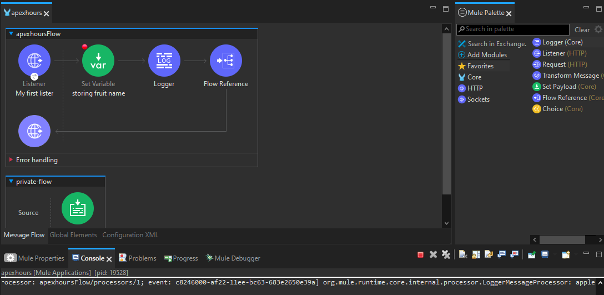
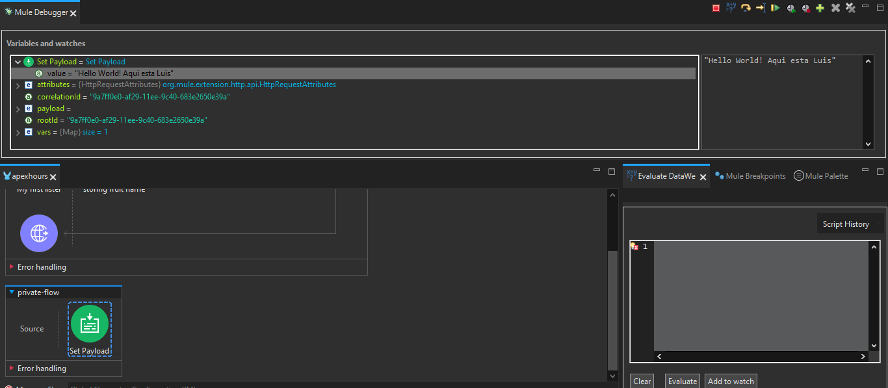

# Flow Reference Connector

El conector "Flow Reference" en Mule 4 es como el mensajero interno de tu aplicación. Su función es dirigir el flujo del mensaje hacia otro lugar específico en tu aplicación. Puedes pensar en él como el encargado de "llamar a otro equipo" dentro de tu aplicación para que realice una tarea específica.

## Ejemplo Simplificado:

Imagina que tu aplicación es como un gran edificio con diferentes equipos en cada piso. Cuando el "Flow Reference" entra en acción, es como si alguien tomara el mensaje y dijera: "¡Oye, ve al piso 5 y dile al equipo de ventas que necesitamos ayuda!". Así, el mensaje se dirige directamente al lugar adecuado en tu aplicación.

## Configuración Básica:
```xml
<flow name="flujoPrincipal">
    <!-- ... otros componentes del flujo ... -->
    <flow-ref name="equipoVentas" doc:name="Flow Reference"/>
</flow>

<flow name="equipoVentas">
    <!-- Este es el equipo de ventas que atenderá el mensaje -->
    <!-- ... otros componentes del flujo de ventas ... -->
</flow>
```

En este ejemplo, cuando el mensaje llega al "Flow Reference" llamado "equipoVentas," se dirige directamente al equipo de ventas para que realice su trabajo. Es como si alguien en tu aplicación estuviera haciendo una llamada interna para obtener ayuda específica. ¡Y así es como el "Flow Reference" guía el flujo del mensaje en Mule 4!

# Actividad, Parte 1

1. Haremos un pequeño cambio, quitaremos el `Set Payload` de nuestro `Flow` y en su lugar colocaremos un `Transform Message`, siendo que este ahora nos aparece una sección de código en la cual colocaremos lo siguiente

    ```json
    %dw 2.0
    output application/json
    ---
    "Hello World! Luis E. esta aquí"
    ```

2. Guardamos, corremos el programa, vamos a la url que ya conocemos y en vez de descargar un archivo aparecera un `JSON` en el navegador con el mensaje

3. Ahora haremos uso de un `Private Flow`, para ello arrastramos al canvas un nuevo `Flow` y lo nombraremos como `private-flow`

4. Arrastramos de nuestro `FLow` principal el conector de `Transform Message` y lo colocamos dentro del `Process` de nuestro `private-flow`

5. Seleccionamos ahora desde `Mule Palette` el conectorde `Flow Reference` y lo colocamos dentro del `Process` de nuestro `Flow` principal

6. Nos dara un error y es que necesitamos decirle a que le debe hacer referencia asi que seleccionando nuestro `Flow Reference` en la parte de inferior nos aparecera la opción de `Flow name`, simplemente damos click al toggle y seleccionamos nuestro `Private Flow` y todo deberia estar en orden

<div align="center">
    
</div>

7. Si lo guardamos y corremos podremos probar que sigue funcionando

> [!TIP]
> Podemos hacer uso de Postman o cualquier otra aplicación para probar APIs para seguir comprobando que todo vaya en orden

## Debuging

8. Para hacer debug podemos colocar `Breakpoints`, para este caso solo colocaremos 1 en nuestro `Flow Reference`, simplemente damos click derecho sobre este y seleccionamos la opción de `add breakpoint`

9. Con lo anterior realizado en vez de correr el programa como lo hacemos normalmente seleccionaremos la opcion de `Debug project "nombreDelProyecto"`

10. La vista de nuestro IDE cambiara, pero no veremos nada en particular, para ello una vez que terminde de cargar, iremos a nuestro (en este caso Thunder Client) probador de APIs y intentaremos solicitar la respuesta, veremos que esta vez de queda cargando

11. Si volvemos al `Anypoint Studio` veremos que ahora aparece un cuadro punteado rodeando nuestro `Flow Reference` y además veremos que aparecen sus `meta-datos` en una de las pantallas

> [!NOTE]
> Recordemos que del Listener al Flow Reference es un Mule Event, por ende tiene atributos, los cuales son los que vemos y antes nombre también como meta-datos

<div align="center">
    
</div>

12. Después de revisar los atributos y meta-data que nos aparece podemos dar click en la flecha amarilla que nos indica `next processor`, osea que pasara a realizar la siguiente operacion de nuestro programa

13. Ahora veremos nuestro `Transform Message` y sus atributos, volvemos a dar `next processor` y terminara. Por ende en nuetro request ya podremos ver el mensaje esperado

# Variable Connector

En Mule 4, la variable principal es simplemente llamada `variable` Puedes pensar en ella como un pequeño espacio de almacenamiento temporal dentro de tu aplicación, como una nota adhesiva donde puedes escribir información importante. Esta variable te permite guardar y acceder a valores a medida que el mensaje viaja a través de los diferentes componentes de tu flujo.

## Ejemplo Simplificado:

Imagina que estás manejando un paquete que pasa por diferentes habitaciones en tu aplicación. La "variable" es como un pequeño casillero en cada habitación. Cuando necesitas dejar algo (un valor) para que el próximo equipo lo vea, simplemente lo colocas en ese casillero. Luego, cuando el mensaje pasa a la siguiente habitación, el equipo allí puede revisar lo que guardaste.

## Configuración Básica:
```xml
<set-variable variableName="nombreVariable" value="Información importante" doc:name="Set Variable"/>
```

En este ejemplo, estamos usando el componente "Set Variable" para colocar información importante en la variable llamada "nombreVariable." Es como si estuviéramos escribiendo un mensaje en la nota adhesiva y pegándola en el casillero. Luego, otros equipos en la aplicación pueden leer esa nota y usar la información que contiene. ¡Y así es como las variables en Mule 4 te permiten recordar y compartir información a lo largo del viaje del mensaje!

# Actividad, Parte 2

1. Detenemos el proceso de Debug si es que aún lo tenemos activo y para volver a la vista de diseño damos click en la parte superior derecha de `Anypoint Studio` donde veremos 3 iconos de mule, el de en medio `Mule Design` es donde debemos dar click para volver a la vista de diseño

2. Ahora desde `Mule Palette` arrastramos el conector `Set Variable` y lo colocaremos entre nuestro `Listener` y nuestro `Flow Reference`

3. Si lo seleccionamos veremos que nos pide algunos atributos a colocar, para los cuales les daremos los siguientes valores:
    - Display Name: storing fruit name
    - Name: fruitName
    - _`Fx`_: #["apple"]

4. Removeremos el `breakpoint` de nuestro `Flow reference` y ahora lo colocaremos en nuestra variable

5. Corremos el programa en modo `Debug` para ver ahora como afecta la variable al comportamiento de nuestro programa

6. Una vez se nos marque en consola que esta desplegado volveremos a realizar nuestra petición con nuestro tester de APIs para que el debug comience a funcionar

7. Veremos que el borde punteado esta en nuestra variable y por ende podemos ver sus meta-datos, entre estos el `vars` pero nos da un `size = 0`. Eso indica que no se ha procesado la variable y por ende no tiene valor, al menos por el momento

8. Si damos click en `Next processor` ahora estara el borde punteado en `Flow Reference` y ahora veremos que el `vars` se manetiene y esta vez de un `size = 1` que si lo revisamos veremos el valor que le dimos a la variable de `apple`

<div align="center">
    
</div>

> [!NOTE]
> Para este punto cambie de Thunder Client a RapidAPI Client

9. Terminamos el debug y ahora borramos el `Transform Message` y lo cambiamos de nuevo por el `Set Payload` como lo teniamos en un inicio, teniendo en su _`Fx`_ el valor de `#["Hello World! Emmanuel Aqui"]`

# Logger Component

El componente "Logger" en Mule 4 actúa como el reportero de tu aplicación. Su tarea principal es registrarlo todo y crear un registro de eventos que te permite seguir la pista de lo que está sucediendo en tu flujo. Puedes pensar en él como un cronista que documenta lo que ocurre en cada paso del camino.

## Ejemplo Simplificado:

Imagina que tu aplicación es como un libro, y el "Logger" es el escritor que agrega comentarios a cada página. Cada vez que algo significativo sucede en tu aplicación, el "Logger" toma nota y lo agrega al registro. Así, cuando revisas el registro, puedes ver exactamente lo que sucedió en cada parte de tu aplicación.

## Configuración Básica:
```xml
<logger message="¡Esto es importante!" level="INFO" doc:name="Logger"/>
```

En este ejemplo, estamos usando el "Logger" para registrar un mensaje importante. Es como si el escritor estuviera añadiendo una nota en el libro de eventos de la aplicación. Cuando revisas el registro, encontrarás esta nota que dice "¡Esto es importante!" en el momento en que ocurrió. ¡Y así es como el "Logger" te ayuda a mantener un seguimiento detallado de lo que sucede en tu aplicación Mule 4!

# Practica, Parte 3

1. Ahora haremos uso del `Logger`, lo buscamos en nuestro `Mule Palette` y lo colocamos entre nuestra `variable` y el `Flow Reference`

2. No necesitamos colocar nada en su _`Fx`_, pero no nos serviria de nada, asi que colocaremos lo siguiente:
    ```css
    #[vars.fruitName]
    ```

3. Guardamos, compilamos, cuando nos muestre que ya esta desplegado podemos limpiar la consola

4. Ahora volvemos a hacer la peticion en RapidAPI y veremos en en la consola nos mostrara el valor de la variable

<div align="center">
    
</div>

5. Agregamos otro `Logger` justo después de nuestro `Flow Reference` con algun mensaje simple como "Este es el final de nuestro Flow"

6. Podemos hacer debug para ir viendo como se comporta el programa

> [!NOTE]
> Que pasa si pasamos query parameters? pues puedes intentarlo cambiando la URL de la petición con algo asi "​http://localhost:8082/test?technology=MuleSoft", cuando hagamos debug desde la variable en los meta-datos podremos ver el valor de dicha query que pasamos 👀 

7. Ahora le daremos un uso interesante a los queryParams, haremos que el mensaje que nos retorne sea "dinamico", para ello iremos a nuestro `Set Payload` y cambiaremos el código de _`Fx`_ por algo como esto:
    ```css
    #["Hello World! Aqui esta " ++ attributes.queryParams.name]
    ```

8. Lo anterior nos marcara error pero no hay problema, es solo por que de momento piensa que ese valor es `null`, ahora si nos damos cuenta colocamos `name` por ende la url a probar debe ser algo como esto:
    ```
    ​http://localhost:8082/test?name=Luis
    ```

9. Guardamos, compilamos en modo Debug y volvemos a realizar la petición con RapidAPI y veremos que ahora el mensaje que colocamos tiene el valor de el query param que le pasamos

<div align="center">
    
</div>

10. Con todo lo aprendido podemos darle un uso más relista a nuestra variable, asi que vamos a borrarla y agregaremos una nueva en el mismo sitio donde la teniamos antes

11. Ahora vamos a necesitar que esta variable almacene lo que se recibe del `queryParams`, para ello llenaremos las propiedades de la misma de la siguiente forma:
    - Display Name: storing Name
    - Name: name
    - _`Fx`_: #[attributes.queryParams.name]

    Finalmente le agregamos su `breakpoint` para el debug

12. Mientras que ahora en el `Set Payload` en su _`Fx`_ colocaremos lo siguiente:
    ```css
    #["Hello World! Aqui esta " ++ vars.name]
    ```

13. Guardamos, compilamos en modo debug, volvemos a realizar la petición y observamos el comportamiento del programa