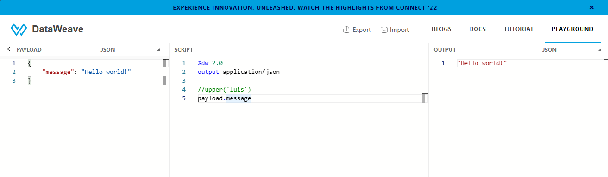

# Dataweave 2.0

Dataweave 2.0 es un lenguaje de transformación de datos que permite manipular, filtrar, enriquecer y transformar datos de diferentes fuentes y formatos. Dataweave 2.0 se integra con la plataforma de MuleSoft, que ofrece una solución completa para la integración y el desarrollo de aplicaciones basadas en APIs. 

Con Dataweave 2.0, se puede acceder a los datos de cualquier origen, ya sea una base de datos, un servicio web, un archivo, una cola de mensajes o cualquier otro tipo de recurso. Dataweave 2.0 también permite definir la estructura y el formato de salida de los datos, ya sea JSON, XML, CSV, Excel o cualquier otro formato soportado por MuleSoft. Dataweave 2.0 facilita la creación de transformaciones complejas y personalizadas mediante una sintaxis simple y expresiva, que se puede escribir tanto en modo gráfico como en modo textual. 

Dataweave 2.0 también ofrece funciones integradas para realizar operaciones comunes sobre los datos, como agrupar, ordenar, filtrar, mapear, reducir, unir, dividir y más. Además, Dataweave 2.0 permite crear funciones personalizadas y reutilizables para encapsular la lógica de negocio y mejorar la legibilidad y el mantenimiento del código. Dataweave 2.0 es un lenguaje poderoso y flexible que facilita la transformación de datos en el contexto de MuleSoft.

# Configuración de Propiedades

En DataWeave 2.0, la configuración de propiedades te permite establecer parámetros específicos que afectan el comportamiento de tus transformaciones. Estas propiedades permiten personalizar el entorno de ejecución de DataWeave según las necesidades de tu aplicación. Aquí hay una visión técnica de cómo puedes trabajar con la configuración de propiedades en DataWeave 2.0:

## Definición de Propiedades:

Para utilizar propiedades en DataWeave 2.0, primero las defines en tu archivo de propiedades externo o en la sección de configuración de tu archivo DataWeave. Puedes especificar propiedades como el tipo de datos predeterminado, la codificación de caracteres, etc.

**Ejemplo de Archivo de Propiedades:**
```properties
dw {
    default-input-encoding: 'UTF-8'
    default-output-encoding: 'UTF-8'
    default-exports: 'all'
}
```

## DataWeave 2.0: Referencia de Propiedades en Transformación

En DataWeave 2.0, la referencia de propiedades en transformaciones te permite acceder a los valores definidos en la configuración de propiedades. Esto brinda flexibilidad al personalizar dinámicamente el entorno de ejecución de tus transformaciones. Aquí está la explicación focalizada en cómo puedes referenciar propiedades utilizando la función `p()` y las expresiones `${}` y `#[]`:

### Utilizando `p()`:

En DataWeave, puedes utilizar la función `p()` para hacer referencia a las propiedades definidas en tu configuración. Esta función permite acceder al valor de la propiedad de manera dinámica durante la ejecución de la transformación.

**Ejemplo de Uso de `p()`:**
```dw
%dw 2.0
output application/json encoding p('dw.default-output-encoding')
---
{
  message: "¡Hola, Mundo!"
}
```

En este ejemplo, estamos utilizando `p('dw.default-output-encoding')` para obtener dinámicamente la codificación de caracteres de salida definida en las propiedades.

### Expresiones `${}` y `#[]`:

Además de `p()`, puedes utilizar las expresiones `${}` y `#[]` para referenciar propiedades en tu transformación.

**Ejemplo de Uso de `${}`:**
```dw
%dw 2.0
output application/json encoding ${p('dw.default-output-encoding')}
---
{
  message: "¡Hola, Mundo!"
}
```

En este caso, estamos utilizando `${}` para incorporar dinámicamente el valor de la propiedad de codificación de caracteres de salida en la transformación.

**Ejemplo de Uso de `#[]`:**
```dw
%dw 2.0
output application/json encoding #[
  p('dw.default-output-encoding')
]
---
{
  message: "¡Hola, Mundo!"
}
```

Aquí, `#[]` se utiliza para realizar la misma referencia dinámica a la propiedad de codificación de caracteres de salida.

### Consideraciones Importantes:

- **Dinamicidad:** Estas expresiones permiten una referencia dinámica, lo que significa que el valor de la propiedad se evalúa en tiempo de ejecución.
- **Flexibilidad:** Puedes utilizar la sintaxis que mejor se adapte a tu preferencia o escenario específico.

La referencia de propiedades en DataWeave 2.0 te proporciona varias opciones para incorporar dinámicamente valores de configuración en tus transformaciones, dándote flexibilidad y control sobre el comportamiento de tus flujos de datos.

## Ventajas de Configuración de Propiedades:

- **Adaptabilidad:** Puedes ajustar dinámicamente la configuración de DataWeave según los requisitos de cada transformación.
- **Reusabilidad:** Al definir propiedades comunes, puedes reutilizarlas en varias transformaciones, manteniendo consistencia en tu aplicación.

## Propiedades Comunes:

Algunas propiedades comunes incluyen:

- **default-input-encoding:** Establece la codificación de caracteres predeterminada para las entradas.
- **default-output-encoding:** Establece la codificación de caracteres predeterminada para las salidas.
- **default-exports:** Controla qué elementos se exportan automáticamente sin necesidad de especificarlos en cada transformación.

## Consideraciones Importantes:

- **Prioridad de Propiedades:** Las propiedades definidas más cerca de la transformación tienen prioridad sobre las definidas en niveles superiores.
- **Validación de Propiedades:** DataWeave valida las propiedades durante la compilación, ayudando a identificar posibles errores antes de la ejecución.

La configuración de propiedades en DataWeave 2.0 proporciona un nivel adicional de control sobre tus transformaciones, permitiéndote adaptar el comportamiento de DataWeave a las necesidades específicas de cada escenario.

> [!IMPORTANT]
> Recuerde, en cualquiera de los casos, debemos reiniciar la aplicación si hay cualquier cambio realizado en el archivo de propiedades para que se reflejen los nuevos valores

# Actividad, Parte 1

1. Vamos a seleccionar nuestro `Listener` y editar la `Connector Configuration` para que en `Port` tenga lo siguiente:
    ```dw
    ${http.port}
    ```

    guardamos y seguimos

2. Si intentaramos correr el programa fallara, así que ahora en nuestro explorador de archivos seleccionamos el paquete de `src/main/resources` y creamos un nuevo archivo `file` al cual le daremos el nombre de `test.properties`

3. En dicho archivo agregaremos lo siguiente:
    ```yaml
    http.port : 8083
    ```

4. Si intentamos correr ahora el programa, volverá a fallar, eso es por que no le hemos dicho que debe hacer uso de dicho archivo, pero vamos a crear uno nuevo, igual en el mismo lugar pero con el nombre de `dev.properties` en el cuál agregaremos lo siguiente:
    ```yaml
    http.port : 8082
    ```

5. Ahora para que sepa que debe hacer uso de nuestros `properties` iremos a la sección de `Global Elements` y daremos click en `Create`

6. Buscamos `Configuration properties` y lo creamos

7. Luego de eso aparecera en nuestro listado de elementos globales, le daremos doble click o en `Edit` mientras lo tenemos seleccionado

8. Tendremos que seleccionar alguno de los archivos que previamente creamos, de momento seleccionamos `dev.properties` y guardamos

9. Si corremos el programa ahora si debería funcionar

10. Ahora pasaremos al `Transform Message`, en el cuál cambiaremos el código que tiene por el siguiente:
    ```properties
    %dw 2.0
    output application/json
    ---
    {
        "Value using dollar" : '${message}',
        "Value using p" : p('message')
    }
    ```

> [!NOTE]
> Colocamos literalmente "dollar" en el mensaje ya que si usabamos el "$" nos iba a dar error ya que el dw lo iba a considerar como parte del código y no hacer caso al error que nos marca el código, el programa igualmente debería funcionar como se espera

11. En cuanto al message, este lo definiremos en nuestro `test.properties` de la siguiente manera:
    ```yaml
    http.port : 8083
    message : Message from properties
    ```

    Como estamos usando el otro archivo asegurade de cambiarlo en los `Global Elements`

12. Corremos el programa y lo probamos en `RapidAPI` recordando en modificar el puerto de ser necesario y deberíamos ver lo siguiente:
    ```json
    {
        "Value using dollar": "Message from properties",
        "Value using p": "Message from properties"
    }
    ```

### Nota de la actividad

Si eliminamos el `message` de nuestro `test.properties` podremos notar una diferencia importante con el uso de `${}` y el `p('')`. Si comentamos o borramos la parte del `dw` que tiene **"Value using p" : p('message')** y corremos el programa este fallará ya que no encuentra el `message` que previamente eliminamos.

Pero si ahora eliminamos (ya que si comentamos igual fallará) el **"Value using dollar" : '${message}',** y corremos el programa este no fallará y cuando hagamos la petición el JSON que nos aparece sera el siguiente
```json
{
    "Value using p": null
}
```

# El Poder de las Características de Vista Previa (Preview Feature)

Las características de vista previa en DataWeave 2.0 representan una potente herramienta que permite a los desarrolladores interactuar con sus datos de manera dinámica y comprender cómo se transforman antes de aplicar las transformaciones en tiempo de ejecución. Aquí desglosamos por qué estas características son fundamentales y cómo aprovecharlas eficazmente:

## Transformación de Datos:

La transformación de datos es la piedra angular de DataWeave 2.0, y las características de vista previa potencian este proceso. Al previsualizar tus transformaciones, puedes observar cómo se alteran los datos antes de implementar los cambios en tus flujos de integración. Esto simplifica la depuración y ajuste fino de tus transformaciones.

## Extracción de Datos:

Con las características de vista previa, puedes extraer porciones específicas de tus datos y ver cómo se presentan antes de decidir cómo manipularlas. Esto facilita la identificación de patrones, la validación de datos y la toma de decisiones informadas sobre cómo estructurar tus transformaciones.

## Conceptos de Objeto y Matriz:

Entender los conceptos de objeto y matriz es crucial al trabajar con DataWeave. Las características de vista previa te permiten explorar cómo se representan estos conceptos en tus datos. Puedes observar la estructura jerárquica de los objetos y la disposición ordenada de los elementos en las matrices, lo que es esencial para navegar eficazmente a través de tus datos.

## Visualización de Resultados Interactiva:

La característica de vista previa ofrece una visualización interactiva de los resultados de tus transformaciones. Puedes experimentar con diferentes expresiones y funciones directamente en la interfaz de usuario para ver instantáneamente cómo afectan tus datos. Esto agiliza el proceso de desarrollo y reduce el tiempo necesario para obtener los resultados deseados.

## Mejor Comprensión del Lenguaje DataWeave:

Al interactuar con las características de vista previa, puedes desarrollar una comprensión más profunda del lenguaje DataWeave 2.0. Puedes experimentar con diversas funciones y expresiones sin la necesidad de ejecutar el código completo, lo que acelera el aprendizaje y la adopción efectiva del lenguaje.

## Facilita la Depuración:

La capacidad de previsualizar transformaciones facilita la depuración al permitirte identificar rápidamente posibles problemas antes de la ejecución completa. Puedes detectar errores, realizar ajustes y perfeccionar tus transformaciones de manera más eficiente.

# Actividad, Parte 2

> [!TIP]
> En la esquina superior derecha de donde escribimos nuestros `dw` del `Transform Message` tenemos el botón de _preview_ el cuál lo que hara es mostrar una vista previa de la respuesta que podemos esperar al momento de hacer la petición

1. Podemos hacer algunas de las actividades en el [Dataweave PlayGround](https://dataweave.mulesoft.com/learn/dataweave)

2. Podemos hace una prueba simple como solo escribir:
    ```properties
    3*2*3
    ```

    y veremos el resultado de esa operación en el `Preview`, lo mismo pasara si lo intentamos en nuestro Anypoit Studio

<div align="center">
    
</div>

# Objectos y Arrays

Al final son lo mismo que cualquier otro lenguaje de programación, en el mismo [Dataweave PlayGround](https://dataweave.mulesoft.com/learn/dataweave) en la sección de `TUTORIAL` podremos encontrar más información al respecto de como se utilizan, etc.

Algo gracioso a probar en el Playground:
```properties
%dw 2.0
output application/json
---
{
    "primer dato" : upper("luis"),
    "segundo dato" : 3+4,
    "mas" : {
        "otro" : 1,
        "array" : [1,2,3,4],
        "arrayObj" : [
            {
                "1" : 1,
            },
            {
                "2" : 2,
                "3" : 3,
            },
        ]
    },
    "raiz" : (sqrt(4)*3)/5,
    "payload" : payload.message
}
```

# DataWeave 2.0: Transformación de un Tipo de Datos a Otro

La capacidad de transformar un tipo de datos a otro es esencial en DataWeave 2.0 y permite la interoperabilidad entre diferentes formatos. Aquí exploramos en detalle las conversiones más comunes y relevantes:

## JSON a XML:

La transformación de JSON a XML se logra utilizando la función `output application/xml`. DataWeave asignará automáticamente las propiedades del objeto JSON a elementos XML, creando una representación XML estructurada.

**Ejemplo:**
```properties
%dw 2.0
output application/xml
---
{
  name: "John",
  age: 30
}
```

## XML a JSON:

La conversión de XML a JSON se realiza mediante la función `output application/json`. DataWeave interpreta la estructura XML y la transforma en un objeto JSON correspondiente.

**Ejemplo:**
```properties
%dw 2.0
output application/json
---
{
  person: {
    name: "John",
    age: 30
  }
}
```

## JSON a CSV:

Para transformar JSON a CSV, puedes utilizar la función `output application/csv`. Esto genera un formato de archivo CSV con encabezados basados en las claves del objeto JSON.

**Ejemplo:**
```properties
%dw 2.0
output application/csv
---
[
  {
    name: "John",
    age: 30
  },
  {
    name: "Jane",
    age: 25
  }
]
```

## XML a CSV:

La transformación de XML a CSV sigue un proceso similar. Primero, conviertes XML a JSON y luego aplicas la función `output application/csv`.

**Ejemplo:**
```properties
%dw 2.0
output application/csv
---
(payload.people map ((person) -> {
  name: person.name,
  age: person.age
}))
```

## Otros Tipos de Conversión:

Además de las conversiones mencionadas, DataWeave 2.0 admite una amplia variedad de transformaciones, incluyendo pero no limitado a:

- **JSON a YAML**
- **XML a YAML**
- **CSV a JSON**
- **CSV a XML**
- **Texto Plano a JSON**
- **Texto Plano a XML**
- **Entre otros...**

**Nota:** La lista es extensa y abarca prácticamente cualquier combinación de formatos comúnmente utilizados.

## Consideraciones Importantes:

- **Mapeo Explícito:** En algunas conversiones más complejas, puede ser necesario realizar un mapeo explícito para estructuras más detalladas.
- **Funciones de Formateo:** DataWeave incluye funciones específicas para el formateo y manipulación detallada de cada tipo de datos, proporcionando flexibilidad en las transformaciones.

La capacidad de DataWeave 2.0 para transformar entre diferentes tipos de datos es fundamental para la integración de sistemas y facilita la interoperabilidad entre diferentes formatos utilizados en el ámbito de la integración y procesamiento de datos.

# Actividad, Parte 3

1. En el [Dataweave PlayGround](https://dataweave.mulesoft.com/learn/dataweave) veremos un cambio de `JSON` a `XML`

2. Dejamos el `JSON` del _payload_ que el _playground_ ya tiene por defecto y en la parte del código simplemente agregaremos esto:
    ```properties
    %dw 2.0
    output application/xml
    ---
    payload
    ```

    veremos en el `output` el payload pero en forma de `XML`

3. Ahora si modificamos el _payload_ con algo como esto:
    ```json
    {
        "name": "Luis",
        "city": "Lerma",
        "age": 26
    }
    ```

    veremos que la salida nos da error, eso es por que a ser `XML` necesitamos **encerrar** dicha información, por asi decirlo

4. Para que funcione solo basta con que hagamos algo como esto:
    ```properties
    %dw 2.0
    output application/xml
    ---
    details : payload
    ```

5. Ahora veamos como funciona esto en nuestro proyecto de `Anypoint studio`, para ello simplemente seleccionamos nuestro `Tansform Message` y cambiamos el código que teniamos por el que colocamos en el _playground_

6. Compilamos y en nuestro `RaidAPI` haremos la petición pero esta vez con un `POST` y enviando en el cuerpo del mismo el _payload_ que teniamos en el _playground_ y veamos lo que nos retorna

7. Si volvemos al _playground_ y en la parte del _payload_ pegamos el `XML`:
    ```xml
    <?xml version='1.0' encoding='UTF-8'?>
    <details>
        <name>Luis</name>
        <city>Lerma</city>
        <age>26</age>
    </details>
    ```

    y queremos pasarlo a un `JSON` simplemente en el _script_ lo escribimos similar a como lo teniamos antes:
    ```properties
    %dw 2.0
    output application/json
    ---
    payload
    ```

    y veremos el _output_ con el `JSON` esperado